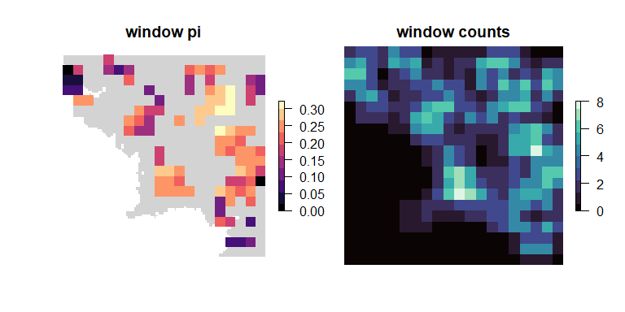

<!-- README.md is generated from README.Rmd. Please edit that file -->

# wingen 

<!-- badges: start -->

[](https://github.com/AnushaPB/wingen/actions/workflows/check-release.yaml)
<!-- badges: end -->

Create maps of genetic diversity using a sliding window approach.

## Installation

Install the development version from [GitHub](https://github.com/) with:

``` r
# install.packages("devtools")
devtools::install_github("AnushaPB/wingen")
```

## Example

``` r
library(wingen)

# load example middle earth data 
load_middle_earth_ex()
```

    ## 
    ## ------------ middle earth loaded -------------
    ##  
    ## Added to GlobalEnv: 
    ## *vcf* vcfR object (1000 loci x 200 samples) 
    ## *coords* dataframe with x and y coordinates 
    ## *lyr* middle earth RasterLayer (100 x 100) 
    ## 
    ## ----------------------------------------------

    ## 

``` r
# Run sliding window calculations of pi with rarefaction
wgd <- window_gd(vcf,
          coords,
          lyr,
          stat = "pi",
          fact = 3,
          wdim = 5,
          rarify = TRUE,
          nloci = 1000)

# Krige results
kgd <- krig_gd(wgd, lyr, disagg = 2)

# Mask results
mgd <- mask_gd(kgd, min_n = 3)

# Plot results
par(mfrow = c(1,3), oma = rep(2,4), mar = rep(2,4))
plot_gd(wgd, main = "Window pi")
plot_gd(kgd, main = "Kriged pi")
plot_gd(mgd, main = "Kriged & masked pi")
```



For an extended example check out the package vignette:

``` r
vignette("wingen-vignette")
```
