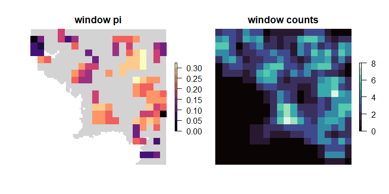
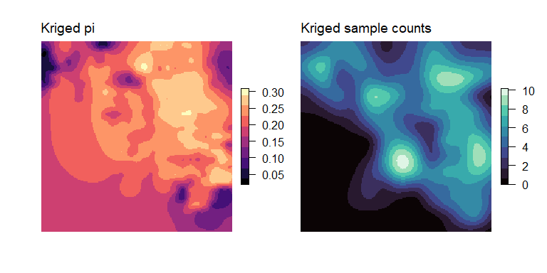
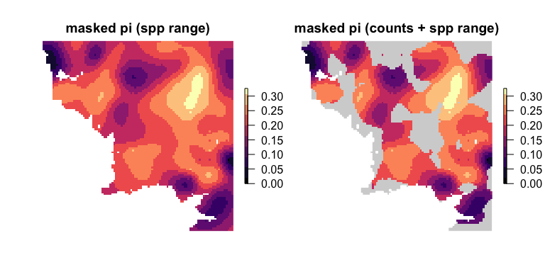

<!-- README.md is generated from README.Rmd. Please edit that file -->


# wingen 

<!-- badges: start -->
<!-- [](https://github.com/AnushaPB/wingen/actions/workflows/check-release.yaml) -->

[](https://codecov.io/gh/AnushaPB/wingen)
[](https://github.com/AnushaPB/wingen/actions/workflows/test-coverage.yaml)
[](https://img.shields.io/badge/license-MIT-blue)

<!-- badges: end -->

Generate continuous maps of genetic diversity using moving windows with
options for rarefaction, interpolation, and masking.

## Installation

Install the development version from [GitHub](https://github.com/) with:

``` r
# install.packages("devtools")
devtools::install_github("AnushaPB/wingen", build_vignettes = TRUE)
```

## Example

The following example demonstrates the basic functionality of wingen
using a **small subset (100 variant loci x 100 samples) of the simulated
data from Bishop et al. (submitted)**.

``` r
library(wingen)
# Load example data
load_middle_earth_ex()
```

The core function of this package is `window_gd()`, which takes as
inputs a vcfR object (or a path to a .vcf file), sample coordinates (as
a data.frame, matrix, or sf object), and a raster layer (as a SpatRaster
or RasterLayer) which the moving window will slide across. Users can
control the genetic diversity statistic that is calculated (`stat`), the
window dimensions (`wdim`), the aggregation factor to use on the raster
(`fact`), whether to perform rarefaction (`rarify`), and other aspects
of the moving window calculations. Additional arguments for this
function are described in the vignette and function documentation.

``` r
# Run moving window calculations of pi with rarefaction
wgd <- window_gd(lotr_vcf,
  lotr_coords,
  lotr_lyr,
  stat = "pi",
  wdim = 7,
  fact = 3,
  rarify = TRUE
)

# Use plot_gd() to plot the genetic diversity layer and plot_count() to plot the sample counts layer
par(mfrow = c(1, 2), oma = rep(1, 4), mar = rep(2, 4))
plot_gd(wgd, bkg = lotr_range, main = "Moving window pi", legend.width = 1.5)
plot_count(wgd, main = "Moving window sample counts", legend.width = 1.5)
```



Next, the output from `window_gd()` can be interpolated using kriging
with the `krig_gd()` function.

``` r
# Krige genetic diversity (disaggregate grid to project across a smoother final surface)
kgd <- krig_gd(wgd[["pi"]], lotr_lyr, disagg_grd = 2)
# Krige counts (aggregate input raster to decrease computational time)
kgd_counts <- krig_gd(wgd[["sample_count"]], lotr_lyr, agg_r = 2, disagg_grd = 2)

par(mfrow = c(1, 2), oma = rep(1, 4), mar = rep(2, 4))
plot_gd(kgd, main = "Kriged pi", legend.width = 1.5)
plot_count(kgd_counts, main = "Kriged sample counts", legend.width = 1.5)
```



Finally, the output from `krig_gd()` (or `window_gd()`) can be masked to
exclude areas that fall outside of the study area or that were
undersampled.

``` r
# Mask results that fall outside of the "range"
mgd_lyr <- mask_gd(kgd, lotr_range)

# Further mask results in areas where the sample count was less than minval
mgd_counts <- mask_gd(mgd_lyr, kgd_counts, minval = 2)
```

``` r
# Plot results
par(mfrow = c(1, 2), oma = rep(1, 4), mar = rep(2, 4))
plot_gd(mgd_lyr, main = "Masked pi (range)", legend.width = 1.5)
plot_gd(mgd_counts, bkg = lotr_range, main = "Masked pi (sample counts + range)", legend.width = 1.5)
```



For an extended walk through, see the package vignette:

``` r
vignette("wingen-vignette")
```

Example analyses from Bishop et al. can be found in the
[paperex](https://github.com/AnushaPB/wingen/tree/main/paperex)
directory.
