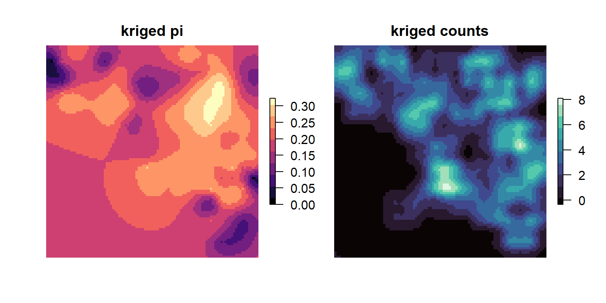
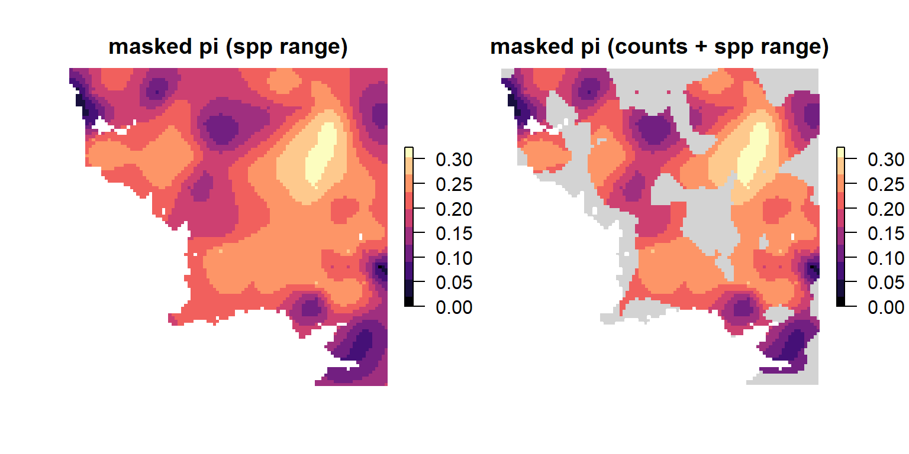

<!-- README.md is generated from README.Rmd. Please edit that file -->

# wingen 

<!-- badges: start -->
<!-- [](https://github.com/AnushaPB/wingen/actions/workflows/check-release.yaml) -->

[](https://codecov.io/gh/AnushaPB/wingen)
[](https://github.com/AnushaPB/wingen/actions/workflows/test-coverage.yaml)
[](https://img.shields.io/badge/license-MIT-blue)
<!-- badges: end -->

Generate continuous maps of genetic diversity using moving windows

## Installation

Install the development version from [GitHub](https://github.com/) with:

``` r
# install.packages("devtools")
devtools::install_github("AnushaPB/wingen", build_vignettes = TRUE)
```

## Example

``` r
library(wingen)

# load example data
load_middle_earth_ex()
```


    -------------- middle earth example --------------
     
    Objects loaded: 
    *lotr_vcf* vcfR object (100 loci x 100 samples) 
    *lotr_coords* dataframe with x and y coordinates 
    *lotr_lyr* middle earth RasterLayer (100 x 100) 
    *lotr_range* SpatialPolygonsDataFrame of spp range 

    --------------------------------------------------

``` r
# Run moving window calculations of pi with rarefaction
wgd <- window_gd(lotr_vcf,
          lotr_coords,
          lotr_lyr,
          stat = "pi",
          wdim = 3,
          fact = 5,
          rarify = TRUE)

par(mfrow = c(1,2), oma = rep(1,4), mar = rep(2,4))
plot_gd(wgd, bkg = lotr_range, main = "window pi")
plot_count(wgd, main = "window counts")
```


``` r
# Krige results
kgd <- krig_gd(wgd[[1]], lotr_lyr)
kgd_counts <- krig_gd(wgd[[2]], lotr_lyr)

par(mfrow = c(1,2), oma = rep(1,4), mar = rep(2,4))
plot_gd(kgd, main = "kriged pi")
plot_count(kgd_counts, main = "kriged counts")
```



``` r
# Mask results
mgd_lyr <- mask_gd(kgd, lotr_range, minval = 0.01)
mgd_counts <- mask_gd(mgd_lyr, kgd_counts, minval = 2)

# Plot results
par(mfrow = c(1,2), oma = rep(1,4), mar = rep(2,4))
plot_gd(mgd_lyr, main = "masked pi (spp range)")
plot_gd(mgd_counts, bkg = lotr_range, main = "masked pi (counts + spp range)")
```



For an extended example check out the package vignette:

``` r
vignette("wingen-vignette")
```
