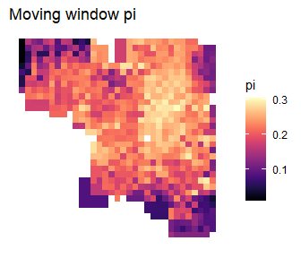
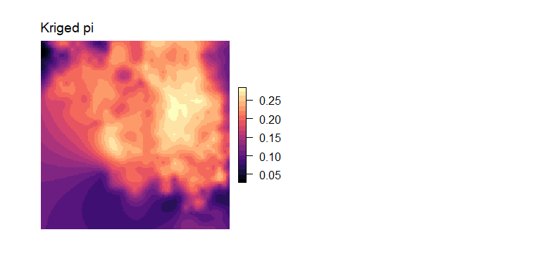
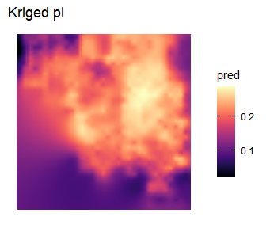

<!-- README.md is generated from README.Rmd. Please edit that file -->

# wingen 

<!-- badges: start -->
<!-- [](https://github.com/AnushaPB/wingen/actions/workflows/check-release.yaml) -->

[](https://codecov.io/gh/AnushaPB/wingen)
[](https://github.com/AnushaPB/wingen/actions/workflows/test-coverage.yaml)
[](https://img.shields.io/badge/license-MIT-blue)
<!-- badges: end -->

Generate continuous maps of genetic diversity using moving windows with
options for rarefaction, kriging, and masking.

## Installation

Install the development version from [GitHub](https://github.com/) with:

``` r
# install.packages("devtools")
devtools::install_github("AnushaPB/wingen", build_vignettes = TRUE)
```

## Example

The following example demonstrates the basic functionality of `wingen`
using a subset of the simulated data from Bishop et al. (202X). For more
details about this data set check out the [original paper](LINK) and the
package vignette.

``` r
library(wingen)

# load example data
load_middle_earth_ex()
```

The core function of this package is `window_gd` which takes as inputs a
vcfR object (or a path to a .vcf file), sample coordinates, and a raster
layer which the moving window will slide across. Users can control the
genetic diversity statistic that is calculated (`stat`), the window
dimensions (`wdim`), the aggregation factor to use on the raster
(`fact`), whether to perform rarefaction (`rarify`), and other aspects
of the moving window calculations. Additional arguments for this
function are described in the vignette and function documentation.

``` r
# Run moving window calculations of pi with rarefaction
wgd <- window_gd(lotr_vcf,
          lotr_coords,
          lotr_lyr,
          stat = "pi",
          wdim = 3,
          fact = 5,
          rarify = TRUE)

# Use plot_gd() to plot the genetic diversity layer and plot_count() to plot the sample counts layer
par(mfrow = c(1,2), oma = rep(1,4), mar = rep(2,4))
plot_gd(wgd, bkg = lotr_range, main = "window pi")
plot_count(wgd, main = "window counts")
```



Next, the output from `window_gd` can be interpolated using kriging with
the `krig_gd` function.

``` r
# Krige results
kgd <- krig_gd(wgd[["pi"]], lotr_lyr)
kgd_counts <- krig_gd(wgd[["sample_count"]], lotr_lyr)

par(mfrow = c(1,2), oma = rep(1,4), mar = rep(2,4))
plot_gd(kgd, main = "kriged pi")
plot_count(kgd_counts, main = "kriged counts")
```



Finally, the output from `krige_gd` (or `window_gd`) can be masked to
exclude areas that fall outside of the study area or that were
undersampled.

``` r
# Mask results that fall outside of the "range"
mgd_lyr <- mask_gd(kgd, lotr_range, minval = 0.01)

# Further mask results in areas where the sample count was less than minval
mgd_counts <- mask_gd(mgd_lyr, kgd_counts, minval = 2)
```

``` r
# Plot results
par(mfrow = c(1,2), oma = rep(1,4), mar = rep(2,4))
plot_gd(mgd_lyr, main = "masked pi (spp range)")
plot_gd(mgd_counts, bkg = lotr_range, main = "masked pi (counts + spp range)")
```



For an extended example check out the package vignette:

``` r
vignette("wingen-vignette")
```
