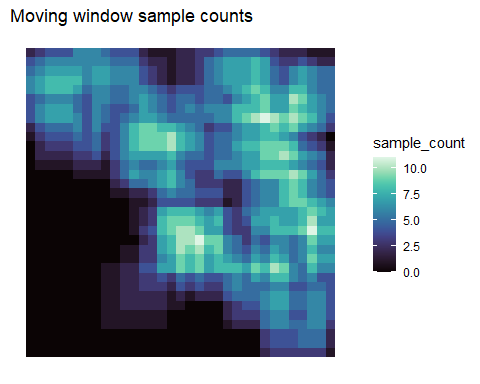
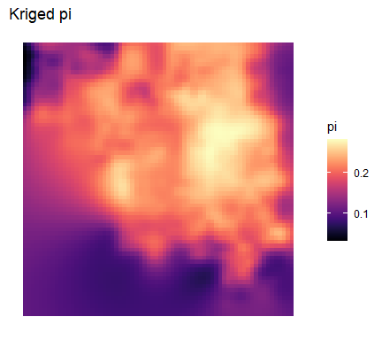
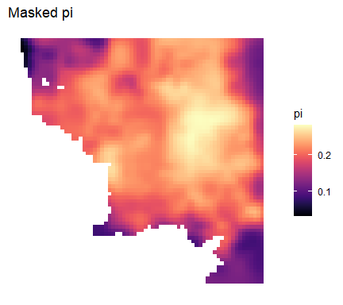

<!-- README.md is generated from README.Rmd. Please edit that file -->

# wingen 

<!-- badges: start -->

[](https://app.codecov.io/gh/AnushaPB/wingen)
[](https://github.com/AnushaPB/wingen/actions/workflows/R-CMD-check.yaml)
[](https://CRAN.R-project.org/package=wingen)
[](https://img.shields.io/badge/license-MIT-blue)
[](https://zenodo.org/badge/latestdoi/499617621)
<!-- badges: end -->

Generate continuous maps of genetic diversity using moving windows with
options for rarefaction, interpolation, and masking.


## Citation

Please cite the original Bishop et al. (2023) paper if you use this
package:

**Bishop, A. P., Chambers, E. A., & Wang, I. J. (2023). Generating
continuous maps of genetic diversity using moving windows. ***Methods in
Ecology and Evolution***, 14, 1175–1181.
<http://doi.org/10.1111/2041-210X.14090>**

Checkout our [Methods blog
post](https://methodsblog.com/2023/05/03/wingen-mapping-genetic-diversity-using-moving-windows/)
about wingen for a quick overview of the package and its uses.

## Installation

Install the released version of wingen from CRAN:

``` r
install.packages("wingen")
```

Or install the development version from GitHub:

``` r
# install.packages("devtools")
devtools::install_github("AnushaPB/wingen")
```

## Example

The following example demonstrates the basic functionality of wingen
using a **small subset (100 variant loci x 100 samples) of the simulated
data from [Bishop et
al. (2023)](http://doi.org/10.1111/2041-210X.14090)**.

``` r
library(wingen)

# Load ggplot for plotting
library(ggplot2)

# Load example data
load_middle_earth_ex()
```

The core function of this package is `window_gd()`, which takes as
inputs a vcfR object (or a path to a .vcf file), sample coordinates (as
a data.frame, matrix, or sf object), and a raster layer (as a SpatRaster
or RasterLayer) which the moving window will slide across. Users can
control the genetic diversity statistic that is calculated (`stat`), the
window dimensions (`wdim`), the aggregation factor to use on the raster
(`fact`), whether to perform rarefaction (`rarify`), and other aspects
of the moving window calculations. Additional arguments for this
function are described in the vignette and function documentation.

``` r
# Run moving window calculations of pi with rarefaction
wgd <- window_gd(lotr_vcf,
  lotr_coords,
  lotr_lyr,
  stat = "pi",
  wdim = 7,
  fact = 3,
  rarify = TRUE
)

# Use ggplot_gd() to plot the genetic diversity layer and ggplot_count() to plot the sample counts layer
ggplot_gd(wgd) +
  ggtitle("Moving window pi")
```

<!-- -->

``` r
ggplot_count(wgd) +
  ggtitle("Moving window sample counts")
```

<!-- -->

Next, the output from `window_gd()` can be interpolated using kriging
with the `krig_gd()` function.

``` r
# Krige genetic diversity (disaggregate grid to project across a smoother final surface)
kgd <- krig_gd(wgd, lotr_lyr, index = 1, disagg_grd = 2)
```

Finally, the output from `krig_gd()` (or `window_gd()`) can be masked to
exclude areas that fall outside of the study area or that were
undersampled.

``` r
# Mask results that fall outside of the "range"
mgd <- mask_gd(kgd, lotr_range)
```

``` r
# Plot results
ggplot_gd(kgd) +
  ggtitle("Kriged pi")
```

<!-- -->

``` r
ggplot_gd(mgd) +
  ggtitle("Masked pi")
```

<!-- -->

For an extended walk through, see the package vignette:

``` r
vignette("wingen-vignette")
```

A pdf of the vignette can also be found
[here](https://github.com/AnushaPB/wingen/blob/main/vignettes/wingen-vignette.pdf)

Example analyses from [Bishop et
al. (2023)](http://doi.org/10.1111/2041-210X.14090) can be found in the
[paperex](https://github.com/AnushaPB/wingen/tree/main/paperex)
directory.
