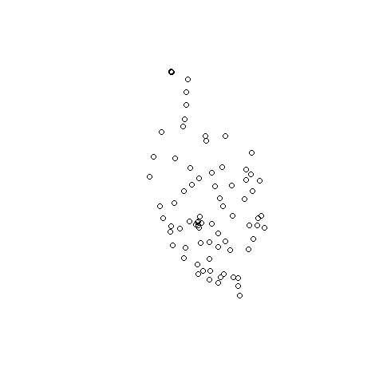
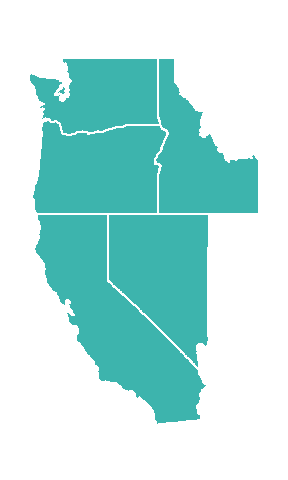
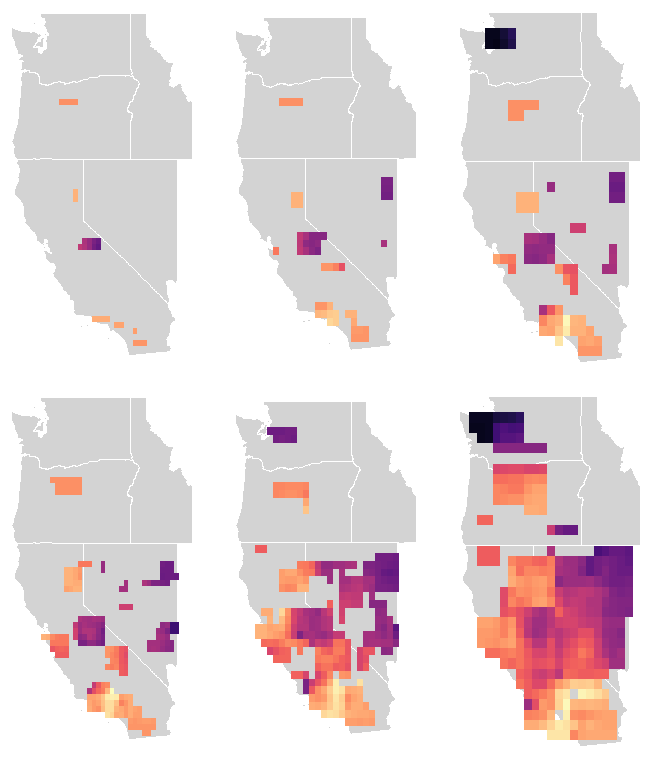
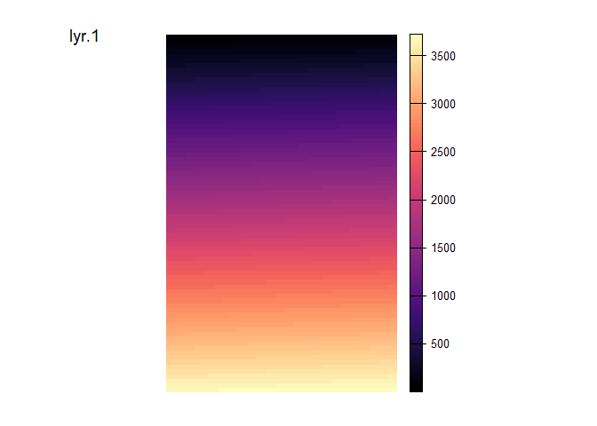

Empirical Example
================

# Empirical Dataset

Data used in this example is from [Bouzid et
al. (2022)](https://doi.org/10.5061/dryad.n5tb2rbv2)

**Bouzid, N. M., Archie, J. W., Anderson, R. A., Grummer, J. A., &
Leaché, A. D. (2022). Evidence for ephemeral ring species formation
during the diversification history of western fence lizards (Sceloporus
occidentalis). Molecular Ecology, 31(2), 620–631.
<https://doi.org/10.1111/mec.15836>**

The vcf used in this example was created from the ped and map file from
Bouzid et al. 2022 using Plink (this is not run as part of the notebook,
but we provide the code below).

``` bash
./plink --file populations_r20.haplotypes.filtered_m70_randomSNP --recode vcf-fid --out populations_r20.haplotypes.filtered_m70_randomSNP
```

``` r
# Genetic data
vcf <- read.vcfR(here(wdir, "data", "populations_r20.haplotypes.filtered_m70_randomSNP.vcf"))
```

    ## Scanning file to determine attributes.
    ## File attributes:
    ##   meta lines: 6
    ##   header_line: 7
    ##   variant count: 6944
    ##   column count: 110
    ## Meta line 6 read in.
    ## All meta lines processed.
    ## gt matrix initialized.
    ## Character matrix gt created.
    ##   Character matrix gt rows: 6944
    ##   Character matrix gt cols: 110
    ##   skip: 0
    ##   nrows: 6944
    ##   row_num: 0
    ## Processed variant 1000Processed variant 2000Processed variant 3000Processed variant 4000Processed variant 5000Processed variant 6000Processed variant: 6944
    ## All variants processed

``` r
# Coordinates
coords <- read.table(here(wdir, "data", "Scelop.coord"))
coords_longlat <- st_as_sf(coords, coords = c("V1", "V2"), crs = "+proj=longlat") 
coords_proj <- st_transform(coords_longlat, crs = 3310)
plot(coords_proj)
```

<!-- -->

Additionally, state data is used from TIGRIS:

``` r
# download states from tigris
states <- states(cb = TRUE)

# reproject into wgs84 to match coordinates
states_longlat <- st_transform(states, crs = "+proj=longlat")
states_proj <- st_transform(states, crs = 3310)

# subset out CONUS
conus <- states_longlat[-which(states_longlat$NAME %in% c("Alaska", "Hawaii", "Puerto Rico", "American Samoa", "Guam", "Commonwealth of the Northern Mariana Islands", "United States Virgin Islands")), "STUSPS"]
# convert to SPDF for plotting
conus <- as_Spatial(conus)

# subset out Northern US
NUS_proj <- states_proj[which(states_proj$NAME %in% c("California", "Oregon", "Washington", "Nevada", "Idaho")), "STUSPS"]
NUS_longlat <- states_longlat[which(states_longlat$NAME %in% c("California", "Oregon", "Washington", "Nevada", "Idaho")), "STUSPS"]

plot(NUS_proj)
```

<!-- -->

### **Figure 4:** Geographic context plots

``` r
par(mar = rep(0,4))
plot(conus, col = "lightgray", border = "lightgray", main = "")
plot(NUS_longlat, col = mako(1, begin = 0.7), border = "white", add = TRUE, main = "")
```

<!-- -->

``` r
par(mar = rep(0,4))
plot(NUS_longlat, col = mako(1, begin = 0.7), border = "white", lwd = 2, main = "")
```

<!-- -->

## Run wingen analysis

First, different parameter combinations are evaluated. Here, we vary the
window size (`wdim`), the raster resolutions (`res`), and the
rarefaction size (`rarify_n`).

### **Figure S5** Comparison of parameters

``` r
params <- df_to_ls(expand.grid(res = c(30000, 40000, 50000), wdim = c(3, 5), rarify_n = c(2, 3, 4)))

stk <- map(params, test_params_empex, vcf, coords_proj)
```

    ## Warning: package 'terra' was built under R version 4.3.2

``` r
stk_longlat <- map(stk, ~terra::project(.x, "+proj=longlat"))

par(mfrow = c(2, 3), mar = rep(1, 4))
walk(stk_longlat, test_empex_plot, bkg = NUS_longlat, zlim = c(0.02, 0.11))
```

<!-- --><!-- --><!-- -->

Based on the results above, we chose a final set of parameters:

``` r
# set parameters 
wdim = 5
fact = 0
res = 30000

# Create final layer 
lyr <- coords_to_raster(coords_proj, res = res, buffer = 10)

plot_gd(lyr, breaks = 100)
```

<!-- -->

And ran the moving window function again, this time kriging and masking
the resulting rasters:

``` r
# Run moving window
set.seed(22)
st <- Sys.time()
pg <- window_gd(vcf, coords_proj, lyr, stat = "pi", wdim = wdim, fact = fact, rarify = TRUE, rarify_n = 2, rarify_nit = 5)
pg_longlat <- terra::project(pg, "+proj=longlat")
Sys.time() - st

plot_gd(pg)
```

<!-- -->

``` r
set.seed(22)
st <- Sys.time()
ag <- window_gd(vcf, coords_proj, lyr, stat = "biallelic_richness", wdim = wdim, fact = fact, rarify = TRUE, rarify_n = 2, rarify_nit = 5)
ag_longlat <- terra::project(ag, "+proj=longlat")
Sys.time() - st

set.seed(22)
st <- Sys.time()
hg <- window_gd(vcf, coords_proj, lyr, stat = "Ho", wdim = wdim, fact = fact, rarify = TRUE, rarify_n = 2, rarify_nit = 5)
hg_longlat <- terra::project(hg, "+proj=longlat")
Sys.time() - st

# krige and mask layers
mpg <- empex_krig_mask(pg, lyr, NUS_longlat)
mag <- empex_krig_mask(ag, lyr, NUS_longlat)
mhg <- empex_krig_mask(hg, lyr, NUS_longlat)
```

### **Figure 4:** Comparison of different measures:

``` r
colpal <- colorRampPalette(c("white", "#EFEDF5", "#DADAEB","#BCBDDC", "#9E9AC8", "#807DBA", "#6A51A3", "#54278F"))
par(mfrow = c(1,3), mar = rep(2,4), oma = rep(2.5,4))
raster_plot_gd(mpg, legend.width = 2, axis.args = list(cex.axis = 1.5), col = colpal(20))
plot(NUS_longlat, add = TRUE, col = NA, border = "#808080", lwd = 2)
plot(coords_longlat, pch = 16, col = "black", cex = 1.5, add = TRUE)

raster_plot_gd(mag, legend.width = 2, axis.args = list(cex.axis = 1.5), col = colpal(20))
plot(NUS_longlat, add = TRUE, col = NA, border = "#808080", lwd = 2)
plot(coords_longlat, pch = 16, col = "black", cex = 1.5, add = TRUE)

raster_plot_gd(mhg, legend.width = 2, axis.args = list(cex.axis = 1.5), col = colpal(20))
plot(NUS_longlat, add = TRUE, col = NA, border = "#808080", lwd = 2)
plot(coords_longlat, pch = 16, col = "black", cex = 1.5, add = TRUE)
```

<!-- -->

### **Figure S6:** moving window calculations with and without rarefaction

``` r
set.seed(22)
pgn <- window_gd(vcf, coords_proj, lyr, stat = "pi", wdim = wdim, fact = fact, rarify = FALSE, min_n = 2, L = nrow(vcf))
pgn_longlat <- terra::project(pgn, "+proj=longlat")

set.seed(22)
agn <- window_gd(vcf, coords_proj, lyr, stat = "biallelic_richness", wdim = wdim, fact = fact, rarify = FALSE, min_n = 2, rarify_alleles = TRUE)
agn_longlat <- terra::project(agn, "+proj=longlat")

set.seed(22)
hgn <- window_gd(vcf, coords_proj, lyr, stat = "Ho", wdim = wdim, fact = fact, rarify = FALSE, min_n = 2)
hgn_longlat <- terra::project(hgn, "+proj=longlat")
```

``` r
par(mfrow = c(2, 3), mar = rep(1,4), oma = rep(3,4))

raster_plot_gd(pg_longlat, NUS_longlat, breaks = 100, legend.width = 2, axis.args = list(cex.axis = 2))
raster_plot_gd(ag_longlat, NUS_longlat, breaks = 100, legend.width = 2, axis.args = list(cex.axis = 2))
raster_plot_gd(hg_longlat, NUS_longlat, breaks = 100, legend.width = 2, axis.args = list(cex.axis = 2))

raster_plot_gd(pgn_longlat, NUS_longlat, breaks = 100, legend.width = 2, axis.args = list(cex.axis = 2))
raster_plot_gd(agn_longlat, NUS_longlat, breaks = 100, legend.width = 2, axis.args = list(cex.axis = 2))
raster_plot_gd(hgn_longlat, NUS_longlat, breaks = 100, legend.width = 2, axis.args = list(cex.axis = 2))
```

<!-- -->

``` r
par(mfrow = c(2, 3), mar = rep(1,4), oma = rep(3,4))

raster_plot_gd(pg_longlat, NUS_longlat, breaks = 100, zlim = get_minmax(pg, pgn), legend.width = 2, axis.args = list(cex.axis = 2))
raster_plot_gd(ag_longlat, NUS_longlat, breaks = 100, zlim = get_minmax(ag, agn), legend.width = 2, axis.args = list(cex.axis = 2))
raster_plot_gd(hg_longlat, NUS_longlat, breaks = 100, zlim = get_minmax(hg, hgn), legend.width = 2, axis.args = list(cex.axis = 2))

raster_plot_gd(pgn_longlat, NUS_longlat, breaks = 100, zlim = get_minmax(pg, pgn), legend.width = 2, axis.args = list(cex.axis = 2))
raster_plot_gd(agn_longlat, NUS_longlat, breaks = 100, zlim = get_minmax(ag, agn), legend.width = 2, axis.args = list(cex.axis = 2))
raster_plot_gd(hgn_longlat, NUS_longlat, breaks = 100, zlim = get_minmax(hg, hgn), legend.width = 2, axis.args = list(cex.axis = 2))
```

<!-- -->

``` r
par(mar = rep(0,4))
raster_plot_gd(ag_longlat[[2]], col = mako(100))
```

<!-- -->
