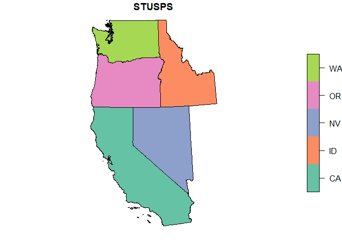
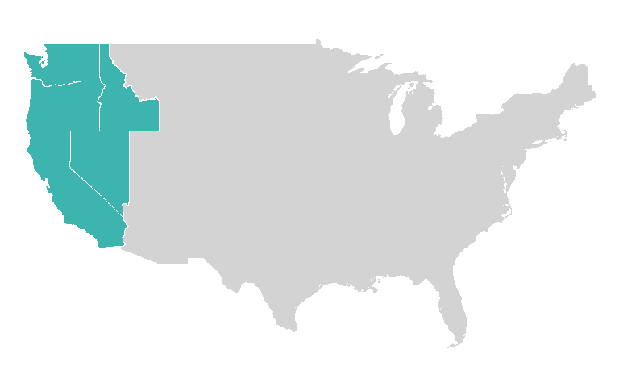
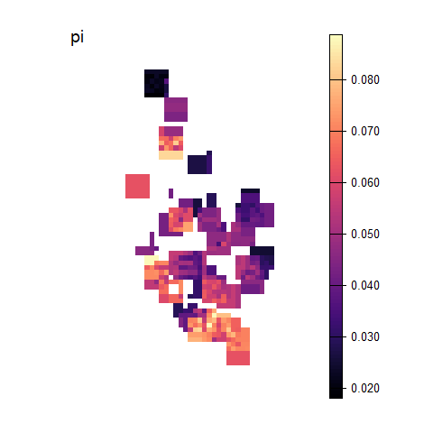
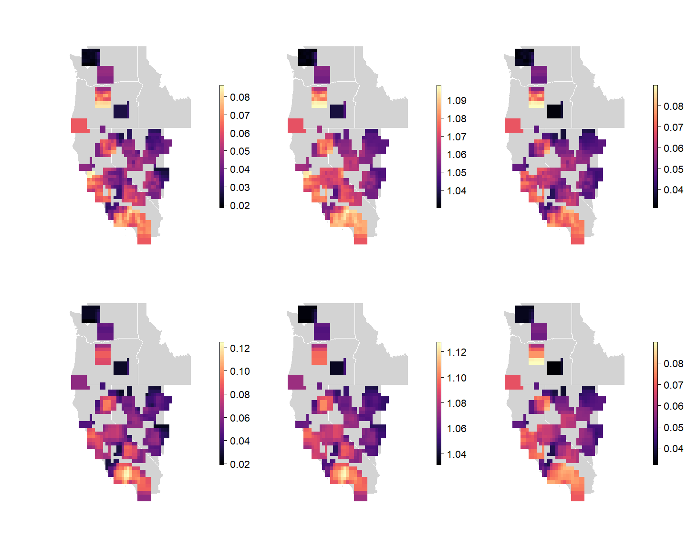

Empirical Example
================

``` r
library(wingen)
library(vcfR)
library(rgdal)
library(raster)
library(viridis)
library(here)
library(tigris)
library(sf)
library(purrr)

wdir <- here("paperex", "empex")
source(here(wdir, "empex_functions.R"))
```

# Empirical Dataset

Data used in this example is from Bouzid et al. (2022):
<https://doi.org/10.5061/dryad.n5tb2rbv2>

**Bouzid, N. M., Archie, J. W., Anderson, R. A., Grummer, J. A., &
Leaché, A. D. (2022). Evidence for ephemeral ring species formation
during the diversification history of western fence lizards ( Sceloporus
occidentalis ). Molecular Ecology, 31(2), 620–631.
<https://doi.org/10.1111/mec.15836>**

``` r
# Genetic data
vcf <- read.vcfR(here(wdir, "data", "populations_r20.haplotypes.filtered_m70_randomSNP.vcf"))
```

    ## Scanning file to determine attributes.
    ## File attributes:
    ##   meta lines: 6
    ##   header_line: 7
    ##   variant count: 6944
    ##   column count: 110
    ## Meta line 6 read in.
    ## All meta lines processed.
    ## gt matrix initialized.
    ## Character matrix gt created.
    ##   Character matrix gt rows: 6944
    ##   Character matrix gt cols: 110
    ##   skip: 0
    ##   nrows: 6944
    ##   row_num: 0
    ## Processed variant 1000Processed variant 2000Processed variant 3000Processed variant 4000Processed variant 5000Processed variant 6000Processed variant: 6944
    ## All variants processed

``` r
# Coordinates
coords <- read.table(here(wdir, "data", "Scelop.coord"))
```

Additionally, state data is used from TIGRIS:

``` r
# download states from tigris
states <- states(cb = TRUE)

# reproject into wgs84 to match coordinates
states <- st_transform(states, 4326)

# convert to SPDF
states <- as_Spatial(states)

# subset out CONUS
conus <- states[-which(states$NAME %in% c("Alaska", "Hawaii", "Puerto Rico", "American Samoa", "Guam", "Commonwealth of the Northern Mariana Islands", "United States Virgin Islands")), "STUSPS"]

# subset out Northern US
NUS <- states[which(states$NAME %in% c("California", "Oregon", "Washington", "Nevada", "Idaho")), "STUSPS"]
```

### **Figure 4:** Geographic context plots

``` r
par(mar = rep(0,4))
plot(conus, col = "lightgray", border = "lightgray", main = "")
plot(NUS, col = mako(1, begin = 0.7), border = "white", add = TRUE, main = "")
```

<!-- -->

``` r
par(mar = rep(0,4))
plot(NUS, col = mako(1, begin = 0.7), border = "white", lwd = 2, main = "")
```

<!-- -->

## Run wingen analysis

First, different parameter combinations are evaluated. Here we vary the
window size (wdim), the raster resolutions (disagg), and the rarefaction
size (rarify_n) to get the plots from Figure S4

``` r
params <- df_to_ls(expand.grid(disagg = c(4, 3, 2), wdim = c(3, 5), rarify_n = c(2, 3, 4)))

stk <- purrr::map(params, test_params_empex, vcf, coords)

par(mfrow = c(2, 3), mar = rep(1, 4))
purrr::walk(stk, test_empex_plot, bkg = NUS, zlim = c(0.02, 0.11))
```

<!-- --><!-- --><!-- -->

Based on the results above we chose a final set of parameters:

``` r
# set parameters 
wdim = 5
fact = 0
disagg = 4

# Create final layer 
lyr <- coords_to_raster(coords, disagg = disagg, buffer = 1)
```

And ran the moving window function again, this time kriging and masking
the resulting rasters:

``` r
# Run moving window
set.seed(22)
system.time(hg <- window_gd(vcf, coords, lyr, stat = "het", wdim = wdim, fact = fact, rarify = TRUE, rarify_n = 2, rarify_nit = 5))

set.seed(22)
system.time(pg <- window_gd(vcf, coords, lyr, stat = "pi", wdim = wdim, fact = fact, rarify = TRUE, rarify_n = 2, rarify_nit = 5))

set.seed(22)
system.time(ag <- window_gd(vcf, coords, lyr, stat = "biallelic.richness", wdim = wdim, fact = fact, rarify = TRUE, rarify_n = 2, rarify_nit = 5))

# Krige and mask layers
kpg <- krig_gd(pg, index = 1, lyr, disagg_grd = 4)
mpg <- mask(kpg, NUS)

kag <- krig_gd(ag, index = 1, lyr, disagg_grd = 4)
mag <- mask(kag, NUS)

khg <- krig_gd(hg, index = 1, lyr, disagg_grd = 4)
mhg <- mask(khg, NUS)
```

### **Figure 4:** Comparison of different measures:

``` r
par(mfrow = c(1,3), mar = rep(0.5,4), oma = rep(2.5,4))
plot_gd(mpg, legend.width = 2,  axis.args = list(cex.axis = 1.5))

plot(NUS, add = TRUE, col = NA, border = "white")
points(coords, pch = 16, col = mako(1, begin = 0.8), cex = 1.5)

plot_gd(mag, legend.width = 2,  axis.args = list(cex.axis = 1.5))
plot(NUS, add = TRUE, col = NA, border = "white")
points(coords, pch = 16, col = mako(1, begin = 0.8), cex = 1.5)

plot_gd(mhg, legend.width = 2,  axis.args = list(cex.axis = 1.5))
plot(NUS, add = TRUE, col = NA, border = "white")
points(coords, pch = 16, col = mako(1, begin = 0.8), cex = 1.5)
```

<!-- -->

### **Figure S5:** moving window calculations with and without rarefaction

``` r
set.seed(22)
hgn <- window_gd(vcf, coords, lyr, stat = "het", wdim = wdim, fact = fact, rarify = FALSE, min_n = 2)

set.seed(22)
pgn <- window_gd(vcf, coords, lyr, stat = "pi", wdim = wdim, fact = fact, rarify = FALSE, min_n = 2, L = nrow(vcf))

set.seed(22)
agn <- window_gd(vcf, coords, lyr, stat = "biallelic.richness", wdim = wdim, fact = fact, rarify = FALSE, min_n = 2, rarify_alleles = TRUE)
```

``` r
par(mfrow = c(2, 3), mar = rep(1,4), oma = rep(3,4))

plot_gd(pg, NUS, breaks = 100, legend.width = 2, axis.args = list(cex.axis = 2))
plot_gd(ag, NUS, breaks = 100, legend.width = 2, axis.args = list(cex.axis = 2))
plot_gd(hg, NUS, breaks = 100, legend.width = 2, axis.args = list(cex.axis = 2))

plot_gd(pgn, NUS, breaks = 100, legend.width = 2, axis.args = list(cex.axis = 2))
plot_gd(agn, NUS, breaks = 100, legend.width = 2, axis.args = list(cex.axis = 2))
plot_gd(hgn, NUS, breaks = 100, legend.width = 2, axis.args = list(cex.axis = 2))
```

<!-- -->

``` r
par(mfrow = c(2, 3), mar = rep(1,4), oma = rep(3,4))

plot_gd(pg, NUS, breaks = 100, zlim = get_minmax(pg, pgn), legend.width = 2, axis.args = list(cex.axis = 2))
plot_gd(ag, NUS, breaks = 100, zlim = get_minmax(ag, agn), legend.width = 2, axis.args = list(cex.axis = 2))
plot_gd(hg, NUS, breaks = 100, zlim = get_minmax(hg, hgn), legend.width = 2, axis.args = list(cex.axis = 2))

plot_gd(pgn, NUS, breaks = 100, zlim = get_minmax(pg, pgn), legend.width = 2, axis.args = list(cex.axis = 2))
plot_gd(agn, NUS, breaks = 100, zlim = get_minmax(ag, agn), legend.width = 2, axis.args = list(cex.axis = 2))
plot_gd(hgn, NUS, breaks = 100, zlim = get_minmax(hg, hgn), legend.width = 2, axis.args = list(cex.axis = 2))
```

<!-- -->

``` r
par(mar = rep(0,4))
plot_count(ag)
```

<!-- -->
