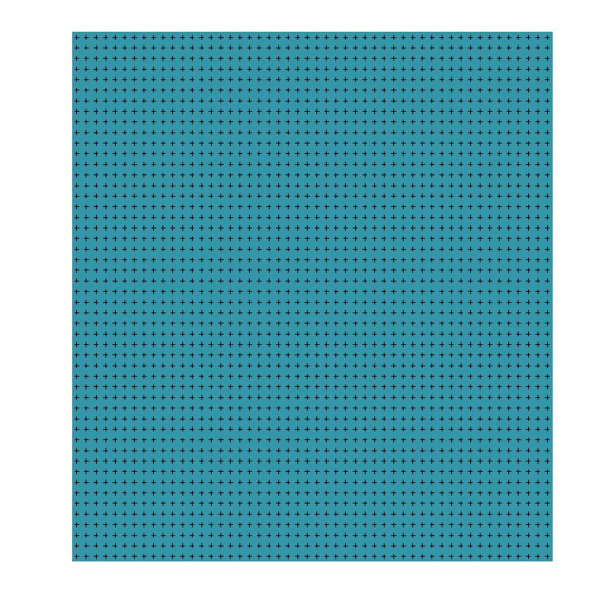
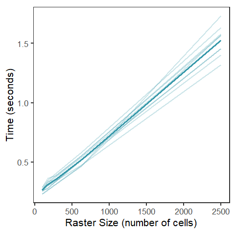

runtime_analysis
================
2022-08-11

``` r
library(wingen)
library(raster)
```

    ## Warning: package 'raster' was built under R version 4.1.3

    ## Loading required package: sp

    ## Warning: package 'sp' was built under R version 4.1.3

``` r
library(ggplot2)
```

    ## Warning: package 'ggplot2' was built under R version 4.1.3

``` r
library(viridis)
```

    ## Warning: package 'viridis' was built under R version 4.1.3

    ## Loading required package: viridisLite

    ## Warning: package 'viridisLite' was built under R version 4.1.3

``` r
library(dplyr)
```

    ## Warning: package 'dplyr' was built under R version 4.1.3

    ## 
    ## Attaching package: 'dplyr'

    ## The following objects are masked from 'package:raster':
    ## 
    ##     intersect, select, union

    ## The following objects are masked from 'package:stats':
    ## 
    ##     filter, lag

    ## The following objects are masked from 'package:base':
    ## 
    ##     intersect, setdiff, setequal, union

``` r
library(vcfR)
```

    ## Warning: package 'vcfR' was built under R version 4.1.3

    ## 
    ##    *****       ***   vcfR   ***       *****
    ##    This is vcfR 1.13.0 
    ##      browseVignettes('vcfR') # Documentation
    ##      citation('vcfR') # Citation
    ##    *****       *****      *****       *****

``` r
library(here)
```

    ## Warning: package 'here' was built under R version 4.1.3

    ## here() starts at C:/Users/Anusha/Documents/GitHub/wingen

``` r
wdir <- here("paperex", "simex")
source(here(wdir, "runtime_functions.R"))
```

# Creating dataset

``` r
# load middle earth example just to get a vcc to modify
load_middle_earth_ex()
```

    ## 
    ## -------------- middle earth example --------------
    ##  
    ## Objects loaded: 
    ## *lotr_vcf* vcfR object (100 loci x 100 samples) 
    ## *lotr_coords* dataframe with x and y coordinates 
    ## *lotr_lyr* middle earth RasterLayer (100 x 100) 
    ## *lotr_range* SpatialPolygonsDataFrame of spp range 
    ## 
    ## --------------------------------------------------

    ## 

``` r
# set dimensions of raster
dim <- 50
# create square raster
m <- matrix(1, ncol = dim, nrow = dim)
lyr <- raster(m)
# make into coordinates for samples such that there is one sample per raster cell
pts <- rasterToPoints(lyr)
coords <- data.frame(pts[,c("x","y")])

# create simple vcf with number of individuals = number of coords and only one locus
vcf <- lotr_vcf[rep(1, 1), c(1, rep(2, nrow(coords)))]

# visualize even sampling
par(pty = "s")
plot(lyr, col = mako(1, begin = 0.6), axes = FALSE, box = FALSE, legend = FALSE)
points(coords, cex = 0.5, pch = 3)
```

<!-- -->

``` r
# evaluate different wdim settings (note: window size = wdim ^ 2)
set.seed(22)
file.name <- here(wdir, "outputs", "runtime_wdim.csv")
if(file.exists(file.name)){
  resw <- read.csv(file.name)
} else {
  resw <- purrr::map_dfr(1:10, time_eval_its, c(3, 5, 7, 9, 11), "wdim", vcf, coords, lyr)
  write.csv(resw, file.name, row.names = FALSE)
}


# evaluate different fact settings (note: number of raster cells = ncell(aggregate(lyr, fact)))
set.seed(22)
file.name <- here(wdir, "outputs", "runtime_fact.csv")
if(file.exists(file.name)){
  resf <- read.csv(file.name)
} else {
  resf <- purrr::map_dfr(1:10, time_eval_its, c(0, 2, 3, 4, 5), "fact", vcf, coords, lyr)
  write.csv(resf, file.name, row.names = FALSE)
}
```

``` r
resw_mean <- resw %>% 
        group_by(wsize) %>% 
        summarise(time = mean(time))

ggplot() +
  geom_line(data = resw, aes(x = wsize, y = time, group = it), 
            col = mako(1, begin = 0.8), alpha = 0.15, lwd = 1) +
  geom_line(data = resw_mean, aes(x = wsize, y = time), 
            col = mako(1, begin = 0.8), alpha = 1, lwd = 1.1) +
  theme_bw() + 
  ylab("time (seconds)") +
  xlab("window size (number of cells)") +
  theme(panel.grid.minor.y = element_blank(), 
        panel.grid.major.y = element_blank(),
        panel.grid.minor.x = element_blank(), 
        panel.grid.major.x = element_blank(),
        aspect.ratio = 1)
```

<!-- -->

``` r
resf_mean <- resf %>% 
        group_by(ncell) %>% 
        summarise(time = mean(time))

ggplot() +
  geom_line(data = resf, aes(x = ncell, y = time, group = it), 
            col = mako(1, begin = 0.6), alpha = 0.1, lwd = 1) +
  geom_line(data = resf_mean, aes(x = ncell, y = time),
            col = mako(1, begin = 0.6), alpha = 1, lwd = 1.1) +
  theme_bw() + 
  ylab("time (seconds)") +
  xlab("number of raster cells") +
  theme(panel.grid.minor.y = element_blank(), 
        panel.grid.major.y = element_blank(),
        panel.grid.minor.x = element_blank(), 
        panel.grid.major.x = element_blank(),
        aspect.ratio = 1)
```

<!-- -->
