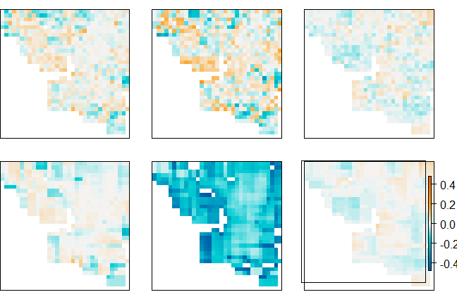
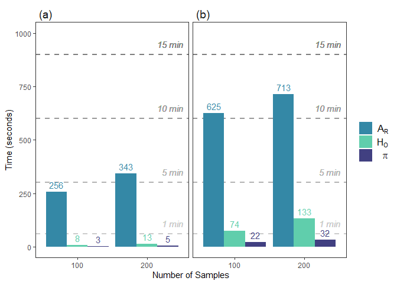

Simulation Example Figures
================

``` r
library(wingen)
library(raster)
library(vcfR)
library(viridis)
library(here)
library(ggplot2)
library(dplyr)
library(purrr)
library(adegenet)

wdir <- here("paperex", "simex")
source(here(wdir, "simex_functions.R"))

# create plot directory
dir.create(here(wdir, "plots"))
```

## Load simulation results

The following function loads the simulated data and subsets it for the
example walkthrough.

``` r
load_middle_earth(subset = TRUE)
```

    ## nvariants 10000 / nind 200

    ## 
    ## --------------------- middle earth data ---------------------
    ##  
    ## Objects loaded: 
    ## *vcf* vcfR object (142129 loci x 1697 samples) 
    ## *coords* dataframe with x and y coordinates 
    ## *subvcf* vcfR object (10000 loci x 200 samples) 
    ## *subcoords* dataframe with x and y coordinates for 200 samples 
    ## *lyr* middle earth RasterLayer (100 x 100) 
    ## *bkg* background layer 
    ## 
    ## -------------------------------------------------------------

    ## 

### Figure 2: Window vs Aggregation Factor

``` r
params <- df_to_ls(expand.grid(wdim = c(3, 5, 7), fact = c(2, 3, 4)))

stk <- map(params, test_params_simex, subvcf, subcoords, lyr)
```

    ## Warning in crs_check_window(lyr, coords): No CRS found for the provided
    ## coordinates. Make sure the coordinates and the raster have the same projection.
    ## Assuming a Euclidean system (see function details or wingen vignette)

    ## Warning in crs_check_window(lyr, coords): No CRS found for the provided raster.
    ## Make sure the coordinates and the raster have the same projection. Assuming a
    ## Euclidean system (see function details or wingen vignette)

    ## Warning in crs_check_window(lyr, coords): No CRS found for the provided
    ## coordinates. Make sure the coordinates and the raster have the same projection.
    ## Assuming a Euclidean system (see function details or wingen vignette)

    ## Warning in crs_check_window(lyr, coords): No CRS found for the provided raster.
    ## Make sure the coordinates and the raster have the same projection. Assuming a
    ## Euclidean system (see function details or wingen vignette)

    ## Warning in crs_check_window(lyr, coords): No CRS found for the provided
    ## coordinates. Make sure the coordinates and the raster have the same projection.
    ## Assuming a Euclidean system (see function details or wingen vignette)

    ## Warning in crs_check_window(lyr, coords): No CRS found for the provided raster.
    ## Make sure the coordinates and the raster have the same projection. Assuming a
    ## Euclidean system (see function details or wingen vignette)

    ## Warning in crs_check_window(lyr, coords): No CRS found for the provided
    ## coordinates. Make sure the coordinates and the raster have the same projection.
    ## Assuming a Euclidean system (see function details or wingen vignette)

    ## Warning in crs_check_window(lyr, coords): No CRS found for the provided raster.
    ## Make sure the coordinates and the raster have the same projection. Assuming a
    ## Euclidean system (see function details or wingen vignette)

    ## Warning in crs_check_window(lyr, coords): No CRS found for the provided
    ## coordinates. Make sure the coordinates and the raster have the same projection.
    ## Assuming a Euclidean system (see function details or wingen vignette)

    ## Warning in crs_check_window(lyr, coords): No CRS found for the provided raster.
    ## Make sure the coordinates and the raster have the same projection. Assuming a
    ## Euclidean system (see function details or wingen vignette)

    ## Warning in crs_check_window(lyr, coords): No CRS found for the provided
    ## coordinates. Make sure the coordinates and the raster have the same projection.
    ## Assuming a Euclidean system (see function details or wingen vignette)

    ## Warning in crs_check_window(lyr, coords): No CRS found for the provided raster.
    ## Make sure the coordinates and the raster have the same projection. Assuming a
    ## Euclidean system (see function details or wingen vignette)

    ## Warning in crs_check_window(lyr, coords): No CRS found for the provided
    ## coordinates. Make sure the coordinates and the raster have the same projection.
    ## Assuming a Euclidean system (see function details or wingen vignette)

    ## Warning in crs_check_window(lyr, coords): No CRS found for the provided raster.
    ## Make sure the coordinates and the raster have the same projection. Assuming a
    ## Euclidean system (see function details or wingen vignette)

    ## Warning in crs_check_window(lyr, coords): No CRS found for the provided
    ## coordinates. Make sure the coordinates and the raster have the same projection.
    ## Assuming a Euclidean system (see function details or wingen vignette)

    ## Warning in crs_check_window(lyr, coords): No CRS found for the provided raster.
    ## Make sure the coordinates and the raster have the same projection. Assuming a
    ## Euclidean system (see function details or wingen vignette)

    ## Warning in crs_check_window(lyr, coords): No CRS found for the provided
    ## coordinates. Make sure the coordinates and the raster have the same projection.
    ## Assuming a Euclidean system (see function details or wingen vignette)

    ## Warning in crs_check_window(lyr, coords): No CRS found for the provided raster.
    ## Make sure the coordinates and the raster have the same projection. Assuming a
    ## Euclidean system (see function details or wingen vignette)

``` r
pdf(here(wdir, "plots", "figure_2.1.pdf"), width = 5, height = 5)
par(mfrow = c(3, 3), mar = rep(0, 4), oma = rep(0, 4), pty = "s")
walk(stk, test_simex_plot, bkg = bkg, polyx = 86, polyy = -102)
dev.off()
```

    ## png 
    ##   2

## Figure 3: Simulation Example

### Simulation setup plots

``` r
# Make kernel density raster from FULL coordinates
kde <- raster(MASS::kde2d(coords$x, coords$y, h = c(10,10), n = 100, lims = c(0,100,-100,0)))

# Plot simulation setup (original lyr, population density, and sample distribution)

# plot of carrying capacity/conductance
pdf(here(wdir, "plots", "figure_3.1.pdf"))
par(mar = rep(2,4), oma = rep(3,4))
plot(lyr, col = viridis::magma(100), axes = FALSE, box = FALSE, axis.args=list(cex.axis = 2), legend.shrink = 0.75, legend.width = 1.5)
dev.off()
```

    ## png 
    ##   2

``` r
# plot of population density
pdf(here(wdir, "plots", "figure_3.2.pdf"))
par(mar = rep(2,4), oma = rep(3,4))
plot(kde, col = viridis::magma(100), axes = FALSE, box = FALSE, axis.args = list(cex.axis = 2), legend.shrink = 0.75, legend.width = 1.5)
dev.off()
```

    ## png 
    ##   2

``` r
# plot of individual distribtuion
pdf(here(wdir, "plots", "figure_3.3.pdf"))
plot(lyr, col = mako(1, begin = 0.1, alpha = 0.1), axes = FALSE, box = FALSE, zlim = c(0.01,1), legend = FALSE)

points(coords$x, coords$y, pch = 16, cex = 1, col = mako(1, begin = 0.7, alpha = 0.4), xlab = "", ylab = "")

points(subcoords$x, subcoords$y, pch = 16, cex = 1, col = mako(1, begin = 0.2, alpha = 0.9), xlab = "", ylab = "")

legend(0,-80, 
       c("All individuals", "Sampled individuals"), 
       pch = c(16,16), 
       col = c(mako(1, begin = 0.7), mako(1, begin = 0.2)),
       bty = "n",
       text.col = "black",
       cex = 2.1)
dev.off()
```

    ## png 
    ##   2

``` r
set.seed(42)

# run moving window
wg <- window_gd(subvcf, 
                subcoords, 
                lyr, 
                stat = "pi", 
                rarify = TRUE, 
                wdim = 7, 
                fact = 3, 
                rarify_n = 2, 
                rarify_nit = 5, 
                parallel = FALSE)
```

    ## Warning in crs_check_window(lyr, coords): No CRS found for the provided
    ## coordinates. Make sure the coordinates and the raster have the same projection.
    ## Assuming a Euclidean system (see function details or wingen vignette)

    ## Warning in crs_check_window(lyr, coords): No CRS found for the provided raster.
    ## Make sure the coordinates and the raster have the same projection. Assuming a
    ## Euclidean system (see function details or wingen vignette)

``` r
# krig results
kg <- krig_gd(wg, lyr, index = 1, disagg_grd = 2)
```

    ## Warning in crs_check_krig(r = r, grd = grd, coords = coords): No CRS found for
    ## the provided raster (r). Make sure that r and grd have the same projection.

    ## Warning in crs_check_krig(r = r, grd = grd, coords = coords): No CRS found for
    ## the provided raster (grd). Make sure that r and grd have the same projection.

    ## [using ordinary kriging]

``` r
# mask areas 
mg <- mask_gd(kg, bkg)

par(mar = rep(0,4))

pdf(here(wdir, "plots", "figure_3.4.pdf"))
raster_plot_gd(wg, bkg, zlim = c(0, 0.31), legend = FALSE)
dev.off()
```

    ## png 
    ##   2

``` r
pdf(here(wdir, "plots", "figure_3.5.pdf"))
raster_plot_count(wg[[2]], legend = FALSE)
dev.off()
```

    ## png 
    ##   2

``` r
pdf(here(wdir, "plots", "figure_3.6.pdf"))
raster_plot_gd(kg, zlim = c(0, 0.31), breaks = 20, legend = FALSE)
dev.off()
```

    ## png 
    ##   2

``` r
pdf(here(wdir, "plots", "figure_3.7.pdf"))
raster_plot_gd(mg, bkg,zlim = c(0, 0.31), breaks = 20, legend = FALSE)
dev.off()
```

    ## png 
    ##   2

``` r
pdf(here(wdir, "plots", "figure_3.8.pdf"))
par(oma = rep(2,4))
raster_plot_gd(kg, zlim = c(0, 0.31), breaks = 20, axis.args = list(cex.axis = 1.75), legend.shrink = 0.7, legend.width = 1.5, legend.only = TRUE)
dev.off()
```

    ## png 
    ##   2

## Figure S1, S2, S3, and S4: Comparison of datasets, statistics, and sample sizes

``` r
params <- df_to_ls(expand.grid(datasets = c("rr", "WGS", "FULL"),
                               rarify = c("TRUE", "FALSE"),
                               stat = c("pi", "biallelic_richness", "Ho")))

# Get example layers for masking (doesn't matter which parameters other than nsamp)
msk_lyr100 <- get_divout(file.name = "rr", rarify = TRUE, stat = "pi", nsamp = 100)

msk_lyr200 <- get_divout(file.name = "rr", rarify = TRUE, stat = "pi", nsamp = 200)

# Get output raster layers
stk100 <- map(params, test_datasets_simex, nsamp = 100, msk_lyr = msk_lyr100)

stk200 <- map(params, test_datasets_simex, nsamp = 200, msk_lyr = msk_lyr200)

# Plot results (note: legends are fixed to the same scale)
par(mfrow = c(2, 3), mar = c(1, 0, 1, 0), oma = rep(0, 4))
walk(stk100, test_simex_plot, legend = FALSE, polyx = 102, polyy = -102)
```

<!-- --><!-- --><!-- -->

``` r
par(mfrow = c(2, 3), mar = c(1, 0, 1, 0), oma = rep(0, 4))
walk(stk200, test_simex_plot, legend = FALSE, polyx = 102, polyy = -102)
```

<!-- --><!-- -->

``` r
# Figure legends:
par(oma = rep(1,4))
plot(stk200[[1]], zlim = c(0, 0.31), legend = TRUE, col = magma(100), legend.only = TRUE,
    legend.width = 2, legend.shrink = 0.75, axis.args = list(cex.axis = 2))

par(oma = rep(1,4))
test_simex_plot(stk200[[1]], zlim = c(1, 1.95), legend = TRUE, col = magma(100), legend.only = TRUE,
        legend.width = 2, legend.shrink = 0.75, axis.args = list(cex.axis = 2))
```

    ## NULL

``` r
par(oma = rep(1,4))
test_simex_plot(stk200[[1]], zlim = c(0, 0.29), legend = TRUE, col = magma(100), legend.only = TRUE,
        legend.width = 2, legend.shrink = 0.75, axis.args = list(cex.axis = 2))
```

<!-- -->

    ## NULL

``` r
params <- df_to_ls(expand.grid(datasets = c("rr", "WGS", "FULL"),
                               stat = c("pi", "biallelic_richness", "Ho"), 
                               rarify = c("TRUE", "FALSE")))

dif200 <- map(c("rr", "WGS"), simex_get_dif, params = params, nsamp = 200)
dif100 <- map(c("rr", "WGS"), simex_get_dif, params = params, nsamp = 100)

par(mfrow = c(2,3), mar = c(1, 0, 1, 0), oma = rep(0, 4))
walk(dif200, ~ map(.x, test_simex_dif_plot, legend = FALSE))
```

<!-- --><!-- -->

``` r
par(mfrow = c(2,3), mar = c(1, 0, 1, 0), oma = rep(0, 4))
walk(dif100, ~ map(.x, test_simex_dif_plot, legend = FALSE))
```

<!-- -->

``` r
par(oma = rep(1,4))
test_simex_dif_plot(dif200[[1]][[1]], legend.only = TRUE, legend = TRUE,
                    legend.width = 1, legend.shrink = 0.75, axis.args = list(cex.axis = 1.5))
```

<!-- -->

    ## NULL

## Figure S7: Computational time for simulation example

``` r
# Loop reads in outputs from simex_tests functions
# To recreate these outputs use the run_sims.sh script (or run the scripts within simex_tests individually)

tdf <- dplyr::bind_rows(get_timeout("rr", rarify = "TRUE", parallel = "FALSE", nsamp = 100),
                        get_timeout("rr", rarify = "TRUE", parallel = "FALSE", nsamp = 200),
                        get_timeout("WGS", rarify = "TRUE", parallel = "TRUE", nsamp = 100),
                        get_timeout("WGS", rarify = "TRUE", parallel = "TRUE", nsamp = 200)
                        )

tdf[tdf$dataset == "rr", "dataset"] <- "(a)"
tdf[tdf$dataset == "WGS", "dataset"] <- "(b)"

ggplot(data = tdf, aes(x = factor(nsamp), y = time, fill = stat)) +
  geom_hline(yintercept = 60, linetype = "dashed", col = "grey80", lwd = 1) + 
  geom_text(aes(factor(200), 60, label = "1 min", vjust = -1, hjust = -0.7), col = "grey80", fontface = "italic") +
  geom_hline(yintercept = 60*5, linetype = "dashed", col = "grey70", lwd = 1) + 
  geom_text(aes(factor(200), 60*5, label = "5 min", vjust = -1, hjust = -0.7), col = "grey70", fontface = "italic") +
  geom_hline(yintercept = 60*10, linetype = "dashed", col = "grey60", lwd = 1) + 
  geom_text(aes(factor(200), 60*10, label = "10 min", vjust = -1, hjust = -0.4), col = "grey60", fontface = "italic") +
  geom_hline(yintercept = 60*15, linetype = "dashed", col = "grey50", lwd = 1) + 
  geom_text(aes(factor(200), 60*15, label = "15 min", vjust = -1, hjust = -0.4), col = "grey50", fontface = "italic") +
  geom_col(position=position_dodge()) +
  geom_text(aes(label = round(time, 0), col = stat), 
            vjust = -0.5, position=position_dodge(width = .9)) + 
  scale_color_manual(values=c("pi"= mako(3, begin = 0.3, end = 0.8)[1], 
                              "allelic richness"= mako(3, begin = 0.3, end = 0.8)[2],
                              "Ho" = mako(3, begin = 0.3, end = 0.8)[3]), 
                    labels = c("pi" = expression(pi),
                               "allelic richness" = bquote(A[R]),
                               "Ho" = bquote(H[O]))) +
  scale_fill_manual(values=c("pi"=mako(3, begin = 0.3, end = 0.8)[1], 
                              "allelic richness"= mako(3, begin = 0.3, end = 0.8)[2],
                              "Ho"= mako(3, begin = 0.3, end = 0.8)[3]), 
                    labels = c("pi" = expression(pi),
                               "allelic richness" = bquote(A[R]),
                               "Ho" = bquote(H[O]))) +
  guides(color = guide_legend(override.aes = list(color = rgb(0,0,0,0)))) +
  facet_grid(~dataset,  scales = "free_y") +
  xlab("Number of Samples") +
  ylab("Time (seconds)") +
  ylim(0,1000) +
  theme_bw() +
  theme(panel.grid.minor.y = element_blank(), 
        panel.grid.major.y = element_blank(),
        panel.grid.minor.x = element_blank(), 
        panel.grid.major.x = element_blank(),
        strip.background = element_blank(),
        strip.text.x = element_text(size = 14, hjust = 0),
        legend.title=element_blank(),
        legend.text = element_text(size=12))
```

<!-- -->

These plots were then edited in Adobe Illustrator to create the final
figures
