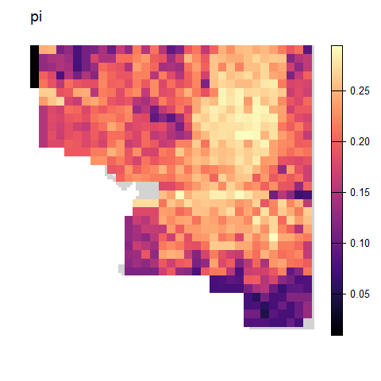
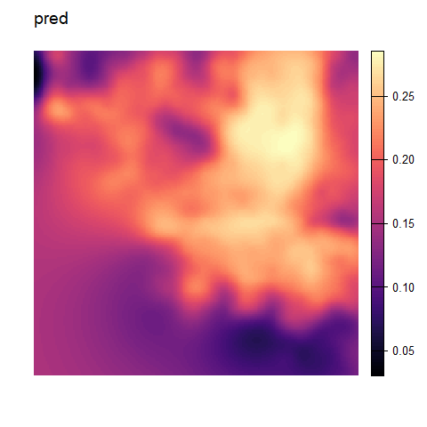
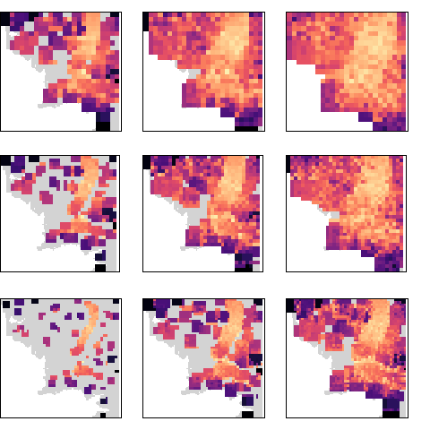
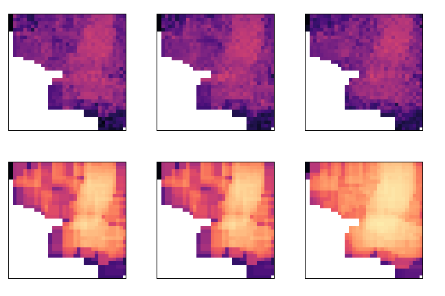
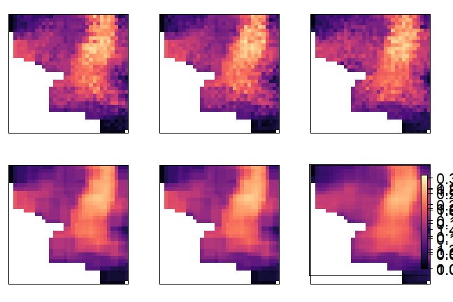
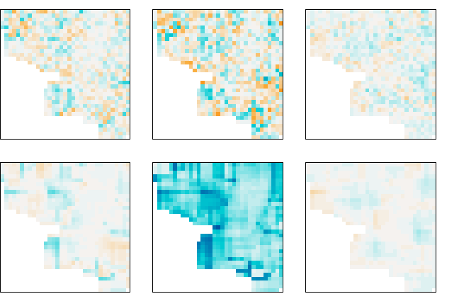

Simulation Example
================

## Load simulation results

The following function loads the simulated data (produced by
`run_simex.sh`) and subsets it for the example walkthrough.

``` r
load_middle_earth(subset = TRUE)
```

    ## nvariants 10000 / nind 200

    ## 
    ## --------------------- middle earth data ---------------------
    ##  
    ## Objects loaded: 
    ## *vcf* vcfR object (142129 loci x 1697 samples) 
    ## *coords* dataframe with x and y coordinates 
    ## *subvcf* vcfR object (10000 loci x 200 samples) 
    ## *subcoords* dataframe with x and y coordinates for 200 samples 
    ## *lyr* middle earth RasterLayer (100 x 100) 
    ## *bkg* background layer 
    ## 
    ## -------------------------------------------------------------

    ## 

## **Figure 3:** Simulation Example

### Simulation setup plots

``` r
# Make kernel density raster from FULL coordinates
kde <- raster(MASS::kde2d(coords$x, coords$y, h = c(10,10), n = 100, lims = c(0,100,-100,0)))

# Plot simulation setup (original lyr, population density, and sample distribution)
par(mar = rep(2,4))
plot(lyr, col = viridis::magma(100), main = "Carrying Capacity/Conductance", axes = FALSE, box = FALSE)
```

<!-- -->

``` r
plot(kde, col = viridis::magma(100), main = "Population Density", axes = FALSE, box = FALSE)
```

<!-- -->

``` r
plot(lyr, col = mako(1, begin = 0.1, alpha = 0.1), main = "Distribution of Individuals", axes = FALSE, box = FALSE, zlim = c(0.01,1), legend = FALSE)
points(coords$x, coords$y, pch = 16, cex = 1, col = mako(1, begin = 0.7, alpha = 0.4), xlab = "", ylab = "")
points(subcoords$x, subcoords$y, pch = 16, cex = 1, col = mako(1, begin = 0.2, alpha = 0.9), xlab = "", ylab = "")
legend(0,-80, 
       c("All Individuals", "Sampled Individuals"), 
       pch = c(16,16), 
       col = c(mako(1, begin = 0.7), mako(1, begin = 0.2)),
       bty = "n",
       text.col = "black",
       cex = 1.5)
```

<!-- -->

**Example moving window analysis:**

``` r
set.seed(42)

# run moving window
wg <- window_gd(subvcf, 
                subcoords, 
                lyr, 
                stat = "pi", 
                rarify = TRUE, 
                wdim = 7, 
                fact = 3, 
                rarify_n = 2, 
                rarify_nit = 5, 
                parallel = FALSE)
```

    ## Warning in crs_check_window(lyr, coords): No CRS found for the provided
    ## coordinates. Make sure the coordinates and the raster have the same projection
    ## (see function details or wingen vignette)

    ## Warning in crs_check_window(lyr, coords): No CRS found for the provided raster.
    ## Make sure the coordinates and the raster have the same projection (see function
    ## details or wingen vignette)

    ## ■■■■ 11% | ETA: 10s ■■■■ 11% | ETA: 11s ■■■■ 12% | ETA: 12s ■■■■■ 13% | ETA:
    ## 12s ■■■■■ 14% | ETA: 12s ■■■■■■ 16% | ETA: 11s ■■■■■■ 18% | ETA: 11s ■■■■■■■
    ## 19% | ETA: 11s ■■■■■■■ 21% | ETA: 11s ■■■■■■■■ 22% | ETA: 11s ■■■■■■■■ 23% |
    ## ETA: 11s ■■■■■■■■■ 25% | ETA: 10s ■■■■■■■■■ 27% | ETA: 10s ■■■■■■■■■ 28% | ETA:
    ## 10s ■■■■■■■■■■ 30% | ETA: 10s ■■■■■■■■■■ 32% | ETA: 9s ■■■■■■■■■■■ 33% | ETA:
    ## 9s ■■■■■■■■■■■ 34% | ETA: 9s ■■■■■■■■■■■■ 36% | ETA: 9s ■■■■■■■■■■■■ 38% | ETA:
    ## 8s ■■■■■■■■■■■■■ 40% | ETA: 8s ■■■■■■■■■■■■■■ 42% | ETA: 8s ■■■■■■■■■■■■■■ 44%
    ## | ETA: 7s ■■■■■■■■■■■■■■■ 46% | ETA: 7s ■■■■■■■■■■■■■■■■ 49% | ETA: 6s
    ## ■■■■■■■■■■■■■■■■ 51% | ETA: 6s ■■■■■■■■■■■■■■■■■ 54% | ETA: 6s
    ## ■■■■■■■■■■■■■■■■■■ 56% | ETA: 5s ■■■■■■■■■■■■■■■■■■ 58% | ETA: 5s
    ## ■■■■■■■■■■■■■■■■■■■ 60% | ETA: 5s ■■■■■■■■■■■■■■■■■■■■ 62% | ETA: 5s
    ## ■■■■■■■■■■■■■■■■■■■■ 64% | ETA: 4s ■■■■■■■■■■■■■■■■■■■■■ 67% | ETA: 4s
    ## ■■■■■■■■■■■■■■■■■■■■■■ 69% | ETA: 4s ■■■■■■■■■■■■■■■■■■■■■■ 71% | ETA: 3s
    ## ■■■■■■■■■■■■■■■■■■■■■■■ 73% | ETA: 3s ■■■■■■■■■■■■■■■■■■■■■■■ 75% | ETA: 3s
    ## ■■■■■■■■■■■■■■■■■■■■■■■■ 77% | ETA: 3s ■■■■■■■■■■■■■■■■■■■■■■■■■ 79% | ETA: 2s
    ## ■■■■■■■■■■■■■■■■■■■■■■■■■■ 84% | ETA: 2s ■■■■■■■■■■■■■■■■■■■■■■■■■■■ 87% | ETA:
    ## 1s ■■■■■■■■■■■■■■■■■■■■■■■■■■■■ 91% | ETA: 1s ■■■■■■■■■■■■■■■■■■■■■■■■■■■■■■
    ## 97% | ETA: 0s

``` r
# krig results
kg <- krig_gd(wg, lyr, index = 1, disagg_grd = 2)
```

    ## Warning in crs_check_krig(r = r, grd = grd, coords = coords): No CRS found for
    ## the provided raster (r). Make sure that r and grd have the same projection.

    ## Warning in crs_check_krig(r = r, grd = grd, coords = coords): No CRS found for
    ## the provided raster (grd). Make sure that r and grd have the same projection.

    ## [using ordinary kriging]

``` r
# mask areas with less than one count
mg <- mask_gd(kg, disaggregate(bkg, 2))

par(mar = rep(0,4))
plot_gd(wg, bkg, zlim = c(0, 0.31))
```

<!-- -->

``` r
plot_count(wg, zlim = c(0,30), horizontal = TRUE)
plot_gd(kg, zlim = c(0, 0.31))
```

<!-- -->

``` r
plot_gd(mg, bkg, zlim = c(0, 0.31), legend = FALSE)
```

<!-- -->

### **Figure 2:** Window vs Aggregation Factor

``` r
params <- df_to_ls(expand.grid(wdim = c(3, 5, 7), fact = c(4, 3, 2)))

stk <- purrr::map(params, test_params_simex, subvcf, subcoords, lyr)
```

    ## Warning in crs_check_window(lyr, coords): No CRS found for the provided
    ## coordinates. Make sure the coordinates and the raster have the same projection
    ## (see function details or wingen vignette)

    ## Warning in crs_check_window(lyr, coords): No CRS found for the provided raster.
    ## Make sure the coordinates and the raster have the same projection (see function
    ## details or wingen vignette)

    ## ■■■■■■■■ 23% | ETA: 3s ■■■■■■■■■ 27% | ETA: 3s ■■■■■■■■■■■ 33% | ETA: 3s
    ## ■■■■■■■■■■■■ 36% | ETA: 3s ■■■■■■■■■■■■■ 40% | ETA: 3s ■■■■■■■■■■■■■■■ 47% |
    ## ETA: 2s ■■■■■■■■■■■■■■■■ 51% | ETA: 2s ■■■■■■■■■■■■■■■■■■■ 58% | ETA: 2s
    ## ■■■■■■■■■■■■■■■■■■■ 61% | ETA: 2s ■■■■■■■■■■■■■■■■■■■■■ 66% | ETA: 2s
    ## ■■■■■■■■■■■■■■■■■■■■■■ 70% | ETA: 1s ■■■■■■■■■■■■■■■■■■■■■■■ 74% | ETA: 1s
    ## ■■■■■■■■■■■■■■■■■■■■■■■■■■ 82% | ETA: 1s ■■■■■■■■■■■■■■■■■■■■■■■■■■■■■ 92% |
    ## ETA: 0s

    ## Warning in crs_check_window(lyr, coords): No CRS found for the provided
    ## coordinates. Make sure the coordinates and the raster have the same projection
    ## (see function details or wingen vignette)

    ## Warning in crs_check_window(lyr, coords): No CRS found for the provided raster.
    ## Make sure the coordinates and the raster have the same projection (see function
    ## details or wingen vignette)

    ## ■■■■■■ 16% | ETA: 6s ■■■■■■■ 18% | ETA: 6s ■■■■■■■ 20% | ETA: 6s ■■■■■■■■ 23% |
    ## ETA: 6s ■■■■■■■■■ 25% | ETA: 6s ■■■■■■■■■■ 28% | ETA: 5s ■■■■■■■■■■ 31% | ETA:
    ## 5s ■■■■■■■■■■■ 34% | ETA: 5s ■■■■■■■■■■■■ 37% | ETA: 5s ■■■■■■■■■■■■■ 39% |
    ## ETA: 5s ■■■■■■■■■■■■■■ 42% | ETA: 4s ■■■■■■■■■■■■■■■ 46% | ETA: 4s
    ## ■■■■■■■■■■■■■■■■ 50% | ETA: 4s ■■■■■■■■■■■■■■■■■ 55% | ETA: 3s
    ## ■■■■■■■■■■■■■■■■■■ 58% | ETA: 3s ■■■■■■■■■■■■■■■■■■■ 59% | ETA: 3s
    ## ■■■■■■■■■■■■■■■■■■■■ 62% | ETA: 3s ■■■■■■■■■■■■■■■■■■■■■ 66% | ETA: 2s
    ## ■■■■■■■■■■■■■■■■■■■■■■ 70% | ETA: 2s ■■■■■■■■■■■■■■■■■■■■■■■ 74% | ETA: 2s
    ## ■■■■■■■■■■■■■■■■■■■■■■■■ 77% | ETA: 2s ■■■■■■■■■■■■■■■■■■■■■■■■■ 79% | ETA: 1s
    ## ■■■■■■■■■■■■■■■■■■■■■■■■■■ 84% | ETA: 1s ■■■■■■■■■■■■■■■■■■■■■■■■■■■■■ 92% |
    ## ETA: 0s

    ## Warning in crs_check_window(lyr, coords): No CRS found for the provided
    ## coordinates. Make sure the coordinates and the raster have the same projection
    ## (see function details or wingen vignette)

    ## Warning in crs_check_window(lyr, coords): No CRS found for the provided raster.
    ## Make sure the coordinates and the raster have the same projection (see function
    ## details or wingen vignette)

    ## ■■■■■■ 16% | ETA: 5s ■■■■■■■ 19% | ETA: 5s ■■■■■■■ 21% | ETA: 5s ■■■■■■■■ 24% |
    ## ETA: 5s ■■■■■■■■■ 26% | ETA: 5s ■■■■■■■■■ 28% | ETA: 5s ■■■■■■■■■■ 31% | ETA:
    ## 5s ■■■■■■■■■■■ 33% | ETA: 5s ■■■■■■■■■■■■ 36% | ETA: 5s ■■■■■■■■■■■■■ 39% |
    ## ETA: 5s ■■■■■■■■■■■■■ 41% | ETA: 4s ■■■■■■■■■■■■■■ 44% | ETA: 4s
    ## ■■■■■■■■■■■■■■■ 47% | ETA: 4s ■■■■■■■■■■■■■■■■ 50% | ETA: 4s ■■■■■■■■■■■■■■■■■
    ## 55% | ETA: 3s ■■■■■■■■■■■■■■■■■■ 58% | ETA: 3s ■■■■■■■■■■■■■■■■■■■ 60% | ETA:
    ## 3s ■■■■■■■■■■■■■■■■■■■■ 63% | ETA: 3s ■■■■■■■■■■■■■■■■■■■■■ 66% | ETA: 2s
    ## ■■■■■■■■■■■■■■■■■■■■■■ 70% | ETA: 2s ■■■■■■■■■■■■■■■■■■■■■■■ 72% | ETA: 2s
    ## ■■■■■■■■■■■■■■■■■■■■■■■ 75% | ETA: 2s ■■■■■■■■■■■■■■■■■■■■■■■■ 77% | ETA: 2s
    ## ■■■■■■■■■■■■■■■■■■■■■■■■■ 81% | ETA: 1s ■■■■■■■■■■■■■■■■■■■■■■■■■■ 84% | ETA:
    ## 1s ■■■■■■■■■■■■■■■■■■■■■■■■■■■■ 91% | ETA: 1s ■■■■■■■■■■■■■■■■■■■■■■■■■■■■■■
    ## 96% | ETA: 0s

    ## Warning in crs_check_window(lyr, coords): No CRS found for the provided
    ## coordinates. Make sure the coordinates and the raster have the same projection
    ## (see function details or wingen vignette)

    ## Warning in crs_check_window(lyr, coords): No CRS found for the provided raster.
    ## Make sure the coordinates and the raster have the same projection (see function
    ## details or wingen vignette)

    ## ■■■■■■■ 20% | ETA: 4s ■■■■■■■■ 22% | ETA: 4s ■■■■■■■■■ 25% | ETA: 4s ■■■■■■■■■■
    ## 29% | ETA: 4s ■■■■■■■■■■■ 34% | ETA: 4s ■■■■■■■■■■■■ 38% | ETA: 3s
    ## ■■■■■■■■■■■■■■ 43% | ETA: 3s ■■■■■■■■■■■■■■■ 46% | ETA: 3s ■■■■■■■■■■■■■■■■ 50%
    ## | ETA: 3s ■■■■■■■■■■■■■■■■■■ 55% | ETA: 2s ■■■■■■■■■■■■■■■■■■ 58% | ETA: 2s
    ## ■■■■■■■■■■■■■■■■■■■■ 63% | ETA: 2s ■■■■■■■■■■■■■■■■■■■■■ 66% | ETA: 2s
    ## ■■■■■■■■■■■■■■■■■■■■■■ 69% | ETA: 2s ■■■■■■■■■■■■■■■■■■■■■■■ 73% | ETA: 1s
    ## ■■■■■■■■■■■■■■■■■■■■■■■■ 76% | ETA: 1s ■■■■■■■■■■■■■■■■■■■■■■■■■■■ 87% | ETA:
    ## 1s ■■■■■■■■■■■■■■■■■■■■■■■■■■■■■■■ 100% | ETA: 0s

    ## Warning in crs_check_window(lyr, coords): No CRS found for the provided
    ## coordinates. Make sure the coordinates and the raster have the same projection
    ## (see function details or wingen vignette)

    ## Warning in crs_check_window(lyr, coords): No CRS found for the provided raster.
    ## Make sure the coordinates and the raster have the same projection (see function
    ## details or wingen vignette)

    ## ■■■■ 11% | ETA: 9s ■■■■ 12% | ETA: 10s ■■■■■ 13% | ETA: 10s ■■■■■ 15% | ETA:
    ## 10s ■■■■■■ 16% | ETA: 10s ■■■■■■ 18% | ETA: 10s ■■■■■■■ 20% | ETA: 9s ■■■■■■■
    ## 20% | ETA: 10s ■■■■■■■■ 22% | ETA: 10s ■■■■■■■■ 24% | ETA: 9s ■■■■■■■■■ 26% |
    ## ETA: 9s ■■■■■■■■■ 28% | ETA: 9s ■■■■■■■■■■ 29% | ETA: 9s ■■■■■■■■■■ 30% | ETA:
    ## 9s ■■■■■■■■■■ 31% | ETA: 9s ■■■■■■■■■■■ 34% | ETA: 8s ■■■■■■■■■■■■ 35% | ETA:
    ## 8s ■■■■■■■■■■■■ 38% | ETA: 8s ■■■■■■■■■■■■■ 40% | ETA: 7s ■■■■■■■■■■■■■■ 42% |
    ## ETA: 7s ■■■■■■■■■■■■■■ 44% | ETA: 7s ■■■■■■■■■■■■■■■ 46% | ETA: 6s
    ## ■■■■■■■■■■■■■■■■ 49% | ETA: 6s ■■■■■■■■■■■■■■■■■ 52% | ETA: 5s
    ## ■■■■■■■■■■■■■■■■■ 55% | ETA: 5s ■■■■■■■■■■■■■■■■■■ 56% | ETA: 5s
    ## ■■■■■■■■■■■■■■■■■■■ 59% | ETA: 5s ■■■■■■■■■■■■■■■■■■■ 61% | ETA: 4s
    ## ■■■■■■■■■■■■■■■■■■■■ 63% | ETA: 4s ■■■■■■■■■■■■■■■■■■■■■ 66% | ETA: 4s
    ## ■■■■■■■■■■■■■■■■■■■■■ 67% | ETA: 4s ■■■■■■■■■■■■■■■■■■■■■■ 69% | ETA: 3s
    ## ■■■■■■■■■■■■■■■■■■■■■■■ 72% | ETA: 3s ■■■■■■■■■■■■■■■■■■■■■■■ 73% | ETA: 3s
    ## ■■■■■■■■■■■■■■■■■■■■■■■■ 76% | ETA: 3s ■■■■■■■■■■■■■■■■■■■■■■■■■ 79% | ETA: 2s
    ## ■■■■■■■■■■■■■■■■■■■■■■■■■ 82% | ETA: 2s ■■■■■■■■■■■■■■■■■■■■■■■■■■■ 88% | ETA:
    ## 1s ■■■■■■■■■■■■■■■■■■■■■■■■■■■■■■ 96% | ETA: 0s

    ## Warning in crs_check_window(lyr, coords): No CRS found for the provided
    ## coordinates. Make sure the coordinates and the raster have the same projection
    ## (see function details or wingen vignette)

    ## Warning in crs_check_window(lyr, coords): No CRS found for the provided raster.
    ## Make sure the coordinates and the raster have the same projection (see function
    ## details or wingen vignette)

    ## ■■■■ 10% | ETA: 11s ■■■■ 11% | ETA: 11s ■■■■■ 12% | ETA: 11s ■■■■■ 14% | ETA:
    ## 11s ■■■■■ 15% | ETA: 12s ■■■■■■ 16% | ETA: 11s ■■■■■■ 17% | ETA: 11s ■■■■■■■
    ## 19% | ETA: 11s ■■■■■■■ 20% | ETA: 11s ■■■■■■■■ 22% | ETA: 11s ■■■■■■■■ 23% |
    ## ETA: 11s ■■■■■■■■ 25% | ETA: 11s ■■■■■■■■■ 26% | ETA: 10s ■■■■■■■■■ 28% | ETA:
    ## 10s ■■■■■■■■■■ 29% | ETA: 10s ■■■■■■■■■■ 31% | ETA: 10s ■■■■■■■■■■ 32% | ETA:
    ## 10s ■■■■■■■■■■■ 33% | ETA: 10s ■■■■■■■■■■■ 34% | ETA: 10s ■■■■■■■■■■■■ 35% |
    ## ETA: 9s ■■■■■■■■■■■■ 37% | ETA: 9s ■■■■■■■■■■■■■ 39% | ETA: 9s ■■■■■■■■■■■■■
    ## 40% | ETA: 9s ■■■■■■■■■■■■■ 41% | ETA: 9s ■■■■■■■■■■■■■■ 43% | ETA: 8s
    ## ■■■■■■■■■■■■■■■ 45% | ETA: 8s ■■■■■■■■■■■■■■■ 47% | ETA: 8s ■■■■■■■■■■■■■■■■
    ## 49% | ETA: 7s ■■■■■■■■■■■■■■■■ 52% | ETA: 7s ■■■■■■■■■■■■■■■■■ 53% | ETA: 6s
    ## ■■■■■■■■■■■■■■■■■■ 55% | ETA: 6s ■■■■■■■■■■■■■■■■■■ 58% | ETA: 6s
    ## ■■■■■■■■■■■■■■■■■■■ 60% | ETA: 5s ■■■■■■■■■■■■■■■■■■■ 61% | ETA: 5s
    ## ■■■■■■■■■■■■■■■■■■■■ 63% | ETA: 5s ■■■■■■■■■■■■■■■■■■■■ 64% | ETA: 5s
    ## ■■■■■■■■■■■■■■■■■■■■■ 67% | ETA: 4s ■■■■■■■■■■■■■■■■■■■■■■ 69% | ETA: 4s
    ## ■■■■■■■■■■■■■■■■■■■■■■ 70% | ETA: 4s ■■■■■■■■■■■■■■■■■■■■■■■ 73% | ETA: 3s
    ## ■■■■■■■■■■■■■■■■■■■■■■■ 75% | ETA: 3s ■■■■■■■■■■■■■■■■■■■■■■■■ 76% | ETA: 3s
    ## ■■■■■■■■■■■■■■■■■■■■■■■■■ 79% | ETA: 3s ■■■■■■■■■■■■■■■■■■■■■■■■■■ 82% | ETA:
    ## 2s ■■■■■■■■■■■■■■■■■■■■■■■■■■■ 85% | ETA: 2s ■■■■■■■■■■■■■■■■■■■■■■■■■■■ 88% |
    ## ETA: 1s ■■■■■■■■■■■■■■■■■■■■■■■■■■■■■ 93% | ETA: 1s
    ## ■■■■■■■■■■■■■■■■■■■■■■■■■■■■■■ 97% | ETA: 0s

    ## Warning in crs_check_window(lyr, coords): No CRS found for the provided
    ## coordinates. Make sure the coordinates and the raster have the same projection
    ## (see function details or wingen vignette)

    ## Warning in crs_check_window(lyr, coords): No CRS found for the provided raster.
    ## Make sure the coordinates and the raster have the same projection (see function
    ## details or wingen vignette)

    ## ■■■■■■ 16% | ETA: 6s ■■■■■■ 18% | ETA: 6s ■■■■■■■■ 22% | ETA: 5s ■■■■■■■■■ 26%
    ## | ETA: 5s ■■■■■■■■■ 28% | ETA: 5s ■■■■■■■■■■ 30% | ETA: 5s ■■■■■■■■■■■ 35% |
    ## ETA: 4s ■■■■■■■■■■■■ 38% | ETA: 4s ■■■■■■■■■■■■■ 40% | ETA: 4s ■■■■■■■■■■■■■■
    ## 43% | ETA: 4s ■■■■■■■■■■■■■■■ 47% | ETA: 4s ■■■■■■■■■■■■■■■■■ 52% | ETA: 3s
    ## ■■■■■■■■■■■■■■■■■■ 56% | ETA: 3s ■■■■■■■■■■■■■■■■■■■ 60% | ETA: 3s
    ## ■■■■■■■■■■■■■■■■■■■■ 63% | ETA: 2s ■■■■■■■■■■■■■■■■■■■■■ 67% | ETA: 2s
    ## ■■■■■■■■■■■■■■■■■■■■■■ 70% | ETA: 2s ■■■■■■■■■■■■■■■■■■■■■■■ 72% | ETA: 2s
    ## ■■■■■■■■■■■■■■■■■■■■■■■■ 77% | ETA: 1s ■■■■■■■■■■■■■■■■■■■■■■■■■■ 82% | ETA: 1s
    ## ■■■■■■■■■■■■■■■■■■■■■■■■■■■■ 89% | ETA: 1s ■■■■■■■■■■■■■■■■■■■■■■■■■■■■■■ 97% |
    ## ETA: 0s

    ## Warning in crs_check_window(lyr, coords): No CRS found for the provided
    ## coordinates. Make sure the coordinates and the raster have the same projection
    ## (see function details or wingen vignette)

    ## Warning in crs_check_window(lyr, coords): No CRS found for the provided raster.
    ## Make sure the coordinates and the raster have the same projection (see function
    ## details or wingen vignette)

    ## ■■■ 7% | ETA: 14s ■■■ 8% | ETA: 15s ■■■■ 10% | ETA: 14s ■■■■ 11% | ETA: 14s
    ## ■■■■■ 12% | ETA: 14s ■■■■■ 13% | ETA: 14s ■■■■■ 14% | ETA: 15s ■■■■■■ 16% |
    ## ETA: 14s ■■■■■■ 16% | ETA: 15s ■■■■■■ 17% | ETA: 14s ■■■■■■■ 19% | ETA: 14s
    ## ■■■■■■■ 20% | ETA: 14s ■■■■■■■■ 22% | ETA: 13s ■■■■■■■■ 24% | ETA: 12s
    ## ■■■■■■■■■ 25% | ETA: 12s ■■■■■■■■■ 26% | ETA: 12s ■■■■■■■■■ 28% | ETA: 12s
    ## ■■■■■■■■■■ 29% | ETA: 11s ■■■■■■■■■■ 31% | ETA: 11s ■■■■■■■■■■■ 32% | ETA: 11s
    ## ■■■■■■■■■■■ 33% | ETA: 11s ■■■■■■■■■■■■ 35% | ETA: 10s ■■■■■■■■■■■■ 37% | ETA:
    ## 10s ■■■■■■■■■■■■■ 39% | ETA: 9s ■■■■■■■■■■■■■ 40% | ETA: 9s ■■■■■■■■■■■■■ 41% |
    ## ETA: 9s ■■■■■■■■■■■■■■ 43% | ETA: 9s ■■■■■■■■■■■■■■ 44% | ETA: 9s
    ## ■■■■■■■■■■■■■■■ 46% | ETA: 8s ■■■■■■■■■■■■■■■ 47% | ETA: 8s ■■■■■■■■■■■■■■■ 48%
    ## | ETA: 8s ■■■■■■■■■■■■■■■■ 49% | ETA: 8s ■■■■■■■■■■■■■■■■ 51% | ETA: 7s
    ## ■■■■■■■■■■■■■■■■■ 53% | ETA: 7s ■■■■■■■■■■■■■■■■■ 55% | ETA: 7s
    ## ■■■■■■■■■■■■■■■■■■ 57% | ETA: 6s ■■■■■■■■■■■■■■■■■■■ 59% | ETA: 6s
    ## ■■■■■■■■■■■■■■■■■■■ 60% | ETA: 6s ■■■■■■■■■■■■■■■■■■■ 62% | ETA: 6s
    ## ■■■■■■■■■■■■■■■■■■■■ 63% | ETA: 5s ■■■■■■■■■■■■■■■■■■■■ 64% | ETA: 5s
    ## ■■■■■■■■■■■■■■■■■■■■■ 65% | ETA: 5s ■■■■■■■■■■■■■■■■■■■■■ 66% | ETA: 5s
    ## ■■■■■■■■■■■■■■■■■■■■■ 68% | ETA: 5s ■■■■■■■■■■■■■■■■■■■■■■ 69% | ETA: 5s
    ## ■■■■■■■■■■■■■■■■■■■■■■ 70% | ETA: 4s ■■■■■■■■■■■■■■■■■■■■■■■ 72% | ETA: 4s
    ## ■■■■■■■■■■■■■■■■■■■■■■■ 73% | ETA: 4s ■■■■■■■■■■■■■■■■■■■■■■■■ 75% | ETA: 4s
    ## ■■■■■■■■■■■■■■■■■■■■■■■■ 78% | ETA: 3s ■■■■■■■■■■■■■■■■■■■■■■■■■ 79% | ETA: 3s
    ## ■■■■■■■■■■■■■■■■■■■■■■■■■■ 82% | ETA: 3s ■■■■■■■■■■■■■■■■■■■■■■■■■■■ 87% | ETA:
    ## 2s ■■■■■■■■■■■■■■■■■■■■■■■■■■■■ 91% | ETA: 1s ■■■■■■■■■■■■■■■■■■■■■■■■■■■■■■
    ## 97% | ETA: 0s

    ## Warning in crs_check_window(lyr, coords): No CRS found for the provided
    ## coordinates. Make sure the coordinates and the raster have the same projection
    ## (see function details or wingen vignette)

    ## Warning in crs_check_window(lyr, coords): No CRS found for the provided raster.
    ## Make sure the coordinates and the raster have the same projection (see function
    ## details or wingen vignette)

    ## ■■ 5% | ETA: 20s ■■■ 5% | ETA: 22s ■■■ 6% | ETA: 22s ■■■ 7% | ETA: 22s ■■■ 8% |
    ## ETA: 23s ■■■ 8% | ETA: 23s ■■■■ 9% | ETA: 23s ■■■■ 9% | ETA: 24s ■■■■ 10% |
    ## ETA: 34s ■■■■ 10% | ETA: 48s ■■■■ 10% | ETA: 49s ■■■■ 11% | ETA: 47s ■■■■ 11% |
    ## ETA: 47s ■■■■■ 12% | ETA: 46s ■■■■■ 12% | ETA: 46s ■■■■■ 13% | ETA: 46s ■■■■■
    ## 13% | ETA: 45s ■■■■■ 14% | ETA: 44s ■■■■■ 15% | ETA: 41s ■■■■■■ 16% | ETA: 40s
    ## ■■■■■■ 17% | ETA: 39s ■■■■■■ 17% | ETA: 38s ■■■■■■ 18% | ETA: 37s ■■■■■■■ 19% |
    ## ETA: 36s ■■■■■■■ 19% | ETA: 35s ■■■■■■■ 20% | ETA: 35s ■■■■■■■ 21% | ETA: 34s
    ## ■■■■■■■ 21% | ETA: 34s ■■■■■■■ 22% | ETA: 35s ■■■■■■■■ 22% | ETA: 34s ■■■■■■■■
    ## 23% | ETA: 33s ■■■■■■■■ 24% | ETA: 33s ■■■■■■■■ 25% | ETA: 31s ■■■■■■■■■ 26% |
    ## ETA: 31s ■■■■■■■■■ 27% | ETA: 30s ■■■■■■■■■ 27% | ETA: 29s ■■■■■■■■■ 28% | ETA:
    ## 28s ■■■■■■■■■■ 29% | ETA: 28s ■■■■■■■■■■ 30% | ETA: 27s ■■■■■■■■■■ 31% | ETA:
    ## 27s ■■■■■■■■■■ 32% | ETA: 26s ■■■■■■■■■■ 32% | ETA: 27s ■■■■■■■■■■■ 33% | ETA:
    ## 26s ■■■■■■■■■■■ 33% | ETA: 25s ■■■■■■■■■■■ 35% | ETA: 24s ■■■■■■■■■■■■ 36% |
    ## ETA: 24s ■■■■■■■■■■■■ 37% | ETA: 23s ■■■■■■■■■■■■ 38% | ETA: 22s ■■■■■■■■■■■■■
    ## 39% | ETA: 22s ■■■■■■■■■■■■■ 40% | ETA: 21s ■■■■■■■■■■■■■ 41% | ETA: 21s
    ## ■■■■■■■■■■■■■ 41% | ETA: 20s ■■■■■■■■■■■■■■ 43% | ETA: 19s ■■■■■■■■■■■■■■ 43% |
    ## ETA: 20s ■■■■■■■■■■■■■■ 43% | ETA: 19s ■■■■■■■■■■■■■■ 44% | ETA: 19s
    ## ■■■■■■■■■■■■■■■ 46% | ETA: 18s ■■■■■■■■■■■■■■■ 47% | ETA: 17s ■■■■■■■■■■■■■■■
    ## 48% | ETA: 17s ■■■■■■■■■■■■■■■■ 50% | ETA: 16s ■■■■■■■■■■■■■■■■ 51% | ETA: 15s
    ## ■■■■■■■■■■■■■■■■■ 52% | ETA: 15s ■■■■■■■■■■■■■■■■■ 54% | ETA: 14s
    ## ■■■■■■■■■■■■■■■■■■ 55% | ETA: 14s ■■■■■■■■■■■■■■■■■■ 56% | ETA: 14s
    ## ■■■■■■■■■■■■■■■■■■ 56% | ETA: 14s ■■■■■■■■■■■■■■■■■■ 57% | ETA: 13s
    ## ■■■■■■■■■■■■■■■■■■ 58% | ETA: 13s ■■■■■■■■■■■■■■■■■■■ 59% | ETA: 12s
    ## ■■■■■■■■■■■■■■■■■■■ 60% | ETA: 12s ■■■■■■■■■■■■■■■■■■■ 61% | ETA: 12s
    ## ■■■■■■■■■■■■■■■■■■■■ 62% | ETA: 11s ■■■■■■■■■■■■■■■■■■■■ 63% | ETA: 11s
    ## ■■■■■■■■■■■■■■■■■■■■ 64% | ETA: 11s ■■■■■■■■■■■■■■■■■■■■■ 65% | ETA: 10s
    ## ■■■■■■■■■■■■■■■■■■■■■ 66% | ETA: 10s ■■■■■■■■■■■■■■■■■■■■■ 67% | ETA: 10s
    ## ■■■■■■■■■■■■■■■■■■■■■ 67% | ETA: 10s ■■■■■■■■■■■■■■■■■■■■■ 67% | ETA: 10s
    ## ■■■■■■■■■■■■■■■■■■■■■■ 69% | ETA: 9s ■■■■■■■■■■■■■■■■■■■■■■ 70% | ETA: 9s
    ## ■■■■■■■■■■■■■■■■■■■■■■ 71% | ETA: 8s ■■■■■■■■■■■■■■■■■■■■■■ 72% | ETA: 8s
    ## ■■■■■■■■■■■■■■■■■■■■■■■ 73% | ETA: 8s ■■■■■■■■■■■■■■■■■■■■■■■ 73% | ETA: 8s
    ## ■■■■■■■■■■■■■■■■■■■■■■■ 75% | ETA: 7s ■■■■■■■■■■■■■■■■■■■■■■■■ 75% | ETA: 7s
    ## ■■■■■■■■■■■■■■■■■■■■■■■■ 77% | ETA: 7s ■■■■■■■■■■■■■■■■■■■■■■■■ 78% | ETA: 6s
    ## ■■■■■■■■■■■■■■■■■■■■■■■■■ 78% | ETA: 6s ■■■■■■■■■■■■■■■■■■■■■■■■■ 80% | ETA: 6s
    ## ■■■■■■■■■■■■■■■■■■■■■■■■■ 81% | ETA: 5s ■■■■■■■■■■■■■■■■■■■■■■■■■■ 83% | ETA:
    ## 5s ■■■■■■■■■■■■■■■■■■■■■■■■■■■ 86% | ETA: 4s ■■■■■■■■■■■■■■■■■■■■■■■■■■■■ 89% |
    ## ETA: 3s ■■■■■■■■■■■■■■■■■■■■■■■■■■■■■ 94% | ETA: 2s
    ## ■■■■■■■■■■■■■■■■■■■■■■■■■■■■■■ 98% | ETA: 1s ■■■■■■■■■■■■■■■■■■■■■■■■■■■■■■■
    ## 100% | ETA: 0s

``` r
par(mfrow = c(3, 3), mar = rep(0, 4), oma = rep(0, 4), pty = "s")
purrr::walk(stk, test_simex_plot, bkg = bkg, polyx = 85, polyy = -100)
```

<!-- -->

## Figure S1, S2, S3, and S4: Comparison of datasets, statistics, and sample sizes

``` r
params <- df_to_ls(expand.grid(datasets = c("rr", "WGS", "FULL"),
                               rarify = c("TRUE", "FALSE"),
                               stat = c("pi", "biallelic_richness", "Ho")))

# Get example layers for masking (doesn't matter which parameters other than nsamp)
msk_lyr100 <- get_divout(file.name = "rr", rarify = TRUE, stat = "pi", nsamp = 100)

msk_lyr200 <- get_divout(file.name = "rr", rarify = TRUE, stat = "pi", nsamp = 200)

# Get output raster layers
stk100 <- map(params, test_datasets_simex, nsamp = 100, msk_lyr = msk_lyr100)

stk200 <- map(params, test_datasets_simex, nsamp = 200, msk_lyr = msk_lyr200)

# Plot results (note: legends are fixed to the same scale)
par(mfrow = c(2, 3), mar = c(1, 0, 1, 0), oma = rep(0, 4))
walk(stk100, test_simex_plot, legend = FALSE)
```

<!-- --><!-- --><!-- -->

``` r
par(mfrow = c(2, 3), mar = c(1, 0, 1, 0), oma = rep(0, 4))
walk(stk200, test_simex_plot, legend = FALSE)
```

<!-- --><!-- -->

``` r
# Figure legends:
par(oma = rep(1,4))
plot(stk200[[1]], zlim = c(0, 0.31), legend = TRUE, col = magma(100), legend.only = TRUE,
    legend.width = 2, legend.shrink = 0.75, axis.args = list(cex.axis = 2))

par(oma = rep(1,4))
test_simex_plot(stk200[[1]], zlim = c(1, 1.95), legend = TRUE, col = magma(100), legend.only = TRUE,
        legend.width = 2, legend.shrink = 0.75, axis.args = list(cex.axis = 2))
```

    ## NULL

``` r
par(oma = rep(1,4))
test_simex_plot(stk200[[1]], zlim = c(0, 0.29), legend = TRUE, col = magma(100), legend.only = TRUE,
        legend.width = 2, legend.shrink = 0.75, axis.args = list(cex.axis = 2))
```

<!-- -->

    ## NULL

``` r
params <- df_to_ls(expand.grid(datasets = c("rr", "WGS", "FULL"),
                               stat = c("pi", "biallelic_richness", "Ho"), 
                               rarify = c("TRUE", "FALSE")))

dif200 <- map(c("rr", "WGS"), simex_get_dif, params = params, nsamp = 200)
dif100 <- map(c("rr", "WGS"), simex_get_dif, params = params, nsamp = 100)

par(mfrow = c(2,3), mar = c(1, 0, 1, 0), oma = rep(0, 4))
walk(dif200, ~ map(.x, test_simex_dif_plot, legend = FALSE))
```

<!-- --><!-- -->

``` r
par(mfrow = c(2,3), mar = c(1, 0, 1, 0), oma = rep(0, 4))
walk(dif100, ~ map(.x, test_simex_dif_plot, legend = FALSE))
```

<!-- -->

``` r
par(oma = rep(1,4))
test_simex_dif_plot(dif200[[1]][[1]], legend.only = TRUE, legend = TRUE, 
                    legend.width = 1, legend.shrink = 0.75, axis.args = list(cex.axis = 1.5))
```

<!-- -->

    ## NULL

## **Figure S7:** Computational time for simulation example

``` r
# Loop reads in outputs from simex_tests functions
# To recreate these outputs use the run_sims.sh script (or run the scripts within simex_tests individually)

tdf <- dplyr::bind_rows(get_timeout("rr", rarify = "TRUE", parallel = "FALSE", nsamp = 100),
                        get_timeout("rr", rarify = "TRUE", parallel = "FALSE", nsamp = 200),
                        get_timeout("WGS", rarify = "TRUE", parallel = "TRUE", nsamp = 100),
                        get_timeout("WGS", rarify = "TRUE", parallel = "TRUE", nsamp = 200)
                        )

tdf[tdf$dataset == "rr", "dataset"] <- "(a)"
tdf[tdf$dataset == "WGS", "dataset"] <- "(b)"

ggplot(data = tdf, aes(x = factor(nsamp), y = time, fill = stat)) +
  geom_hline(yintercept = 60, linetype = "dashed", col = "grey80", lwd = 1) + 
  geom_text(aes(factor(200), 60, label = "1 min", vjust = -1, hjust = -0.7), 
            col = "grey80", fontface = "italic") +
  geom_hline(yintercept = 60*5, linetype = "dashed", col = "grey70", lwd = 1) + 
  geom_text(aes(factor(200), 60*5, label = "5 min", vjust = -1, hjust = -0.7), 
            col = "grey70", fontface = "italic") +
  geom_hline(yintercept = 60*10, linetype = "dashed", col = "grey60", lwd = 1) + 
  geom_text(aes(factor(200), 60*10, label = "10 min", vjust = -1, hjust = -0.4), 
            col = "grey60", fontface = "italic") +
  geom_hline(yintercept = 60*15, linetype = "dashed", col = "grey50", lwd = 1) + 
  geom_text(aes(factor(200), 60*15, label = "15 min", vjust = -1, hjust = -0.4), 
            col = "grey50", fontface = "italic") +
  geom_col(position=position_dodge()) +
  geom_text(aes(label = round(time, 0), col = stat), 
            vjust = -0.5, position=position_dodge(width = .9)) + 
  scale_color_manual(values=c("pi"= mako(3, begin = 0.3, end = 0.8)[1], 
                              "allelic richness"= mako(3, begin = 0.3, end = 0.8)[2],
                              "Ho" = mako(3, begin = 0.3, end = 0.8)[3]), 
                    labels = c("pi" = expression(pi),
                               "allelic richness" = bquote(A[R]),
                               "Ho" = bquote(H[O]))) +
  scale_fill_manual(values=c("pi"=mako(3, begin = 0.3, end = 0.8)[1], 
                              "allelic richness"= mako(3, begin = 0.3, end = 0.8)[2],
                              "Ho"= mako(3, begin = 0.3, end = 0.8)[3]), 
                    labels = c("pi" = expression(pi),
                               "allelic richness" = bquote(A[R]),
                               "Ho" = bquote(H[O]))) +
  guides(color = guide_legend(override.aes = list(color = rgb(0,0,0,0)))) +
  facet_grid(~dataset,  scales = "free_y") +
  xlab("Number of Samples") +
  ylab("Time (seconds)") +
  ylim(0,1000) +
  theme_bw() +
  theme(panel.grid.minor.y = element_blank(), 
        panel.grid.major.y = element_blank(),
        panel.grid.minor.x = element_blank(), 
        panel.grid.major.x = element_blank(),
        strip.background = element_blank(),
        strip.text.x = element_text(size = 14, hjust = 0),
        legend.title=element_blank(),
        legend.text = element_text(size=12))
```

<!-- -->
