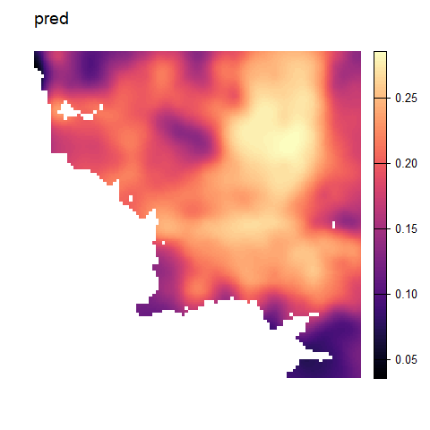
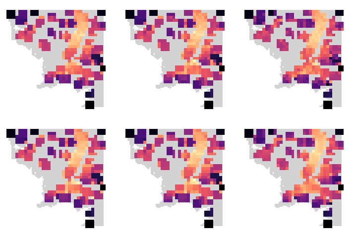
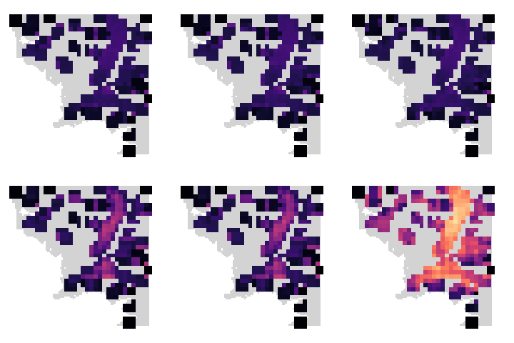
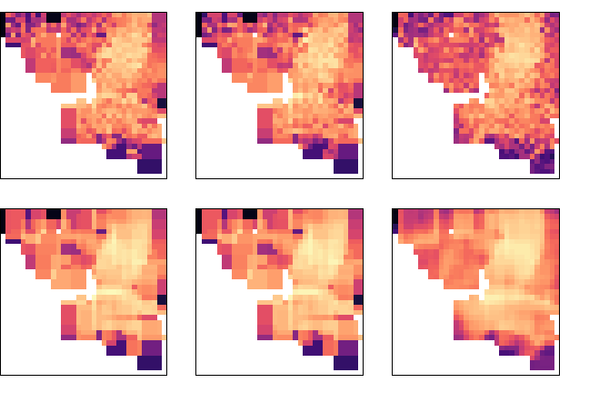
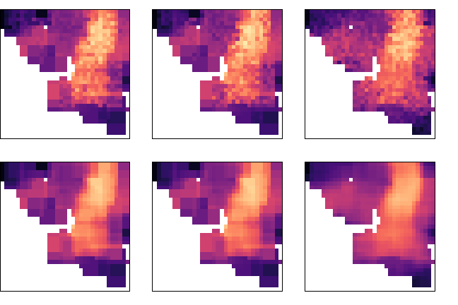
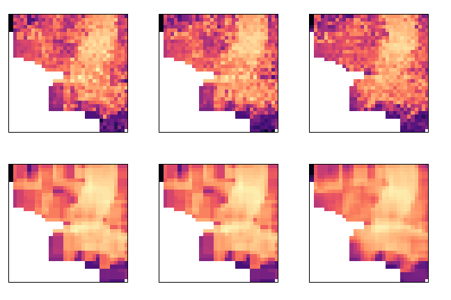

Simulation Example
================

``` r
library(wingen)
library(raster)
library(vcfR)
library(viridis)
library(foreach)
library(doParallel)
library(here)
library(ggplot2)
library(dplyr)
library(purrr)
library(adegenet)
library(hierfstat)

wdir <- here("paperex", "simex")
source(here(wdir, "simex_functions.R"))
```

# Load simulation results

``` r
# Load middle earth layer and format as a raster
lyr <- read.csv(here(wdir, "data", "middle_earth.csv"), header = FALSE)
lyr <- raster(as.matrix(lyr))
extent(lyr) <- extent(0,100,-100,0)
# Create background layer for plotting
bkg <- lyr
bkg[bkg < 0.01] <- NA

# Read in geospatial data and convert coordinates to match lyr
geo <- read.csv(here(wdir, "data", "mod-sim_params_it-0_t-1000_spp-spp_0.csv"))
geo$y <- -geo$y
coords <- geo[,c("idx","x","y")]

# Create file of individual coordinates if it doesn't exist already
set.seed(42)
if(!file.exists(here(wdir, "data", "samples_seed42.csv"))){
  message("creating new file")
  si <- sample(nrow(coords), 200)
  write.csv( data.frame(inds = si), here(wdir, "data", "samples_seed42.csv"), row.names = FALSE)
} else {
  message("loading existing file")
  df <- read.csv(here(wdir, "data", "samples_seed42.csv"))
  si <- df$inds
}
```

    ## loading existing file

``` r
# Subset coords
subcoords <- coords[si,]
subcoords <- subcoords[,c("x","y")]
```

# Figure 2: Simulation Example

## Simulation setup plots

``` r
# Make kernel density raster from FULL coordinates
kde <- raster(MASS::kde2d(coords$x, coords$y, h = c(10,10), n = 100, lims = c(0,100,-100,0)))

# Plot simulation setup (original lyr, population density, and sample distribution)
par(mar = rep(2,4))
plot(lyr, col = viridis::magma(100), main = "Carrying Capacity/Conductance", axes = FALSE, box = FALSE)
```

<!-- -->

``` r
plot(kde, col = viridis::magma(10), main = "Population Density", axes = FALSE, box = FALSE)
```

<!-- -->

``` r
plot(lyr, col = mako(1, begin = 0.1, alpha = 0.1), main = "Distribution of Individuals", axes = FALSE, box = FALSE, zlim = c(0.01,1), legend = FALSE)
points(coords$x, coords$y, pch = 16, cex = 1, col = mako(1, begin = 0.7, alpha = 0.4), xlab = "", ylab = "")
points(subcoords$x, subcoords$y, pch = 16, cex = 1, col = mako(1, begin = 0.2, alpha = 0.9), xlab = "", ylab = "")
legend(0,-80, 
       c("All Individuals", "Sampled Individuals"), 
       pch = c(16,16), 
       col = c(mako(1, begin = 0.7), mako(1, begin = 0.2)),
       bty = "n",
       text.col = "black",
       cex = 1.5)
```

<!-- -->

## Example simulation walkthrough

``` r
# Read in VCF
vcf <- read.vcfR(here(wdir, "data", "mod-sim_params_it-0_t-1000_spp-spp_0.vcf"))
# Sample 10k loci
l <- sample(nrow(vcf@gt), 10000)
# Subset VCF (note: first column of VCF are sample IDs)
subvcf <- vcf[l, c(1, si + 1)]
# check match between VCF and coords
stopifnot(all(colnames(subvcf@gt)[-1] == as.character(geo$idx[si])))

tr <- window_gd(subvcf, 
                subcoords, 
                lyr, 
                stat = "pi", 
                wdim = 3, 
                fact = 3, 
                rarify_n = 2, 
                rarify_nit = 5, 
                rarify = TRUE, 
                parallel = FALSE)
```

``` r
# Get window results
tr <- get_divout(file.name = "rr", rarify = TRUE, stat = "pi", nsamp = 200)

# Get counts layer from preview gd 
ct <- preview_gd(lyr, 
                subcoords, 
                wdim = 3, 
                fact = 3)
```

<!-- --><!-- -->

``` r
# stack moving window and sample count layers
tr <- stack(tr, ct[["sample_count"]])

# plot results
par(mar = rep(0,4), oma = rep(0,4), pty = "s")
plot_gd(tr, bkg, breaks = 10)
```

<!-- -->

``` r
# Krige window raster (disaggregate to get smoother final layer)
tr_k <- krig_gd(tr[[1]], lyr, disagg_grd = 2)
# Assign any values less than 0 to 0 (since pi can't be less than 0)
tr_k[tr_k < 0] <- 0
# Krige count raster (aggregate original raster to reduce computational time)
tr_k_count <- krig_gd(tr[[2]], lyr, agg_r = 2, disagg_grd = 2)
# Assign any values less than 0 to 0 (since counts can't be less than 0)
tr_k_count[tr_k_count < 0] <- 0

# Mask kriged raster with count raster (all areas where counts are less than minval are masked)
tr_k_mask <- mask_gd(tr_k, tr_k_count, minval = 1)

# Plot results
par(mar = rep(1,4), oma = rep(1,4), pty = "s")
plot_gd(tr_k, bkg, breaks = 10, zlim = c(0,0.30))
```

<!-- -->

``` r
plot_gd(tr_k_mask, bkg, breaks = 10, zlim = c(0,0.30))
```

<!-- -->

``` r
plot_count(tr_k_count, zlim = c(0,12))
```

<!-- -->

# Figure \#X: Window vs Aggregation Factor

``` r
params <- df_to_ls(expand.grid(wdim = c(3, 5, 7), fact = c(2, 3, 4)))

stk <- purrr::map(params, test_params_simex, subvcf, subcoords, lyr)

par(mfrow = c(3, 3), mar = rep(0, 4), oma = rep(0, 4), pty = "s")
purrr::walk(stk, test_simex_plot, bkg = bkg, zlim = c(0, 0.30))
```

<!-- -->

# Figure 3 & Figure 1S: Comparison of datasets, statistics, and sample sizes

``` r
params <- df_to_ls(expand.grid(rarify = c("TRUE", "FALSE"),
                               datasets = c("rr", "WGS", "FULL"),
                               stat = c("pi", "biallelic_richness", "heterozygosity")))

# Get example layers for masking (doesn't matter which parameters other than nsamp)
msk_lyr100 <- get_divout(file.name = "rr", rarify = TRUE, stat = "pi", nsamp = 100)

msk_lyr200 <- get_divout(file.name = "rr", rarify = TRUE, stat = "pi", nsamp = 200)

# Get output raster layers
stk100 <- purrr::map(params, test_datasets_simex, nsamp = 100, msk_lyr = msk_lyr100)

stk200 <- purrr::map(params, test_datasets_simex, nsamp = 200, msk_lyr = msk_lyr200)

# Plot results (for figures, legend was set to FALSE)
par(mfrow = c(2, 3), mar = rep(0, 4), oma = rep(0, 4), pty = "s")
purrr::walk(stk100, test_simex_plot, bkg = bkg, legend = TRUE)
```

<!-- --><!-- --><!-- -->

``` r
par(mfrow = c(2, 3), mar = c(1, 0, 1, 0), oma = rep(0, 4), pty = "s")
purrr::walk(stk200, test_simex_plot, bkg = bkg, legend = TRUE)
```

<!-- --><!-- --><!-- -->

# Figure \#X: Timing

``` r
# Loop reads in outputs from time_tests functions
# To recreate these outputs use the run_sims.sh script (or run the scripts within time_tests individually)

tdf <- dplyr::bind_rows(get_timeout("rr", rarify = "TRUE", parallel = "FALSE", nsamp = 100),
                        get_timeout("rr", rarify = "TRUE", parallel = "FALSE", nsamp = 200),
                        get_timeout("WGS", rarify = "TRUE", parallel = "TRUE", nsamp = 100),
                        get_timeout("WGS", rarify = "TRUE", parallel = "TRUE", nsamp = 200)
                        )

tdf[tdf$dataset == "rr", "dataset"] <- "10,000 loci (w/o Parallelization)"
tdf[tdf$dataset == "WGS", "dataset"] <- "100,000 loci (w/ Parallelization)"

ggplot(data = tdf, aes(x = factor(nsamp), y = time, fill = stat)) +
  geom_hline(yintercept = 60, linetype = "dashed", col = "darkgray", lwd = 1) + 
  geom_text(aes(factor(200), 60, label = "1 min", vjust = -1, hjust = -0.7), col = "gray", fontface = "italic") +
  geom_hline(yintercept = 120, linetype = "dashed", col = "gray", lwd = 1) + 
  geom_text(aes(factor(200), 120, label = "2 min", vjust = -1, hjust = -0.7), col = "lightgray", fontface = "italic") +
  geom_hline(yintercept = 180, linetype = "dashed", col = "lightgray", lwd = 1) + 
  geom_text(aes(factor(200), 180, label = "3 min", vjust = -1, hjust = -0.7), col = "lightgray", fontface = "italic") +
  geom_col(position=position_dodge()) +
  geom_text(aes(label = round(time, 0), col = stat), 
            vjust = -0.5, position=position_dodge(width = .9)) + 
  scale_color_manual(values=c("pi"=mako(3, begin = 0.3, end = 0.8)[1], 
                              "allelic richness"=mako(3, begin = 0.3, end = 0.8)[2],
                              "heterozygosity"=mako(3, begin = 0.3, end = 0.8)[3])) +
  scale_fill_manual(values=c("pi"=mako(3, begin = 0.3, end = 0.8)[1], 
                              "allelic richness"=mako(3, begin = 0.3, end = 0.8)[2],
                              "heterozygosity"=mako(3, begin = 0.3, end = 0.8)[3])) +
  guides(color = guide_legend(override.aes = list(color = rgb(0,0,0,0)))) +
  facet_grid(~dataset,  scales = "free_y") +
  xlab("number of samples") +
  ylab("time (seconds)") +
  ylim(0,200) +
  theme_bw() +
  theme(panel.grid.minor.y = element_blank(), 
        panel.grid.major.y = element_blank(),
        panel.grid.minor.x = element_blank(), 
        panel.grid.major.x = element_blank())
```

<!-- -->

# Confirmation that biallelic and allelic richness maps are the same

``` r
load_mini_ex()
set.seed(22)
trab <- window_gd(mini_vcf, mini_coords, mini_lyr, stat = "biallelic.richness", wdim = 3, fact = 3, rarify_n = 2, rarify_nit = 5, rarify = TRUE, parallel = FALSE)
set.seed(22)
tra <- window_gd(mini_vcf, mini_coords, mini_lyr, stat = "allelic.richness", wdim = 3, fact = 3, rarify_n = 2, rarify_nit = 5, rarify = TRUE, parallel = FALSE)
plot_gd(trab)
plot_gd(tra)

r <- raster("outputs/WGS_rarifyTRUE_nsamp200_nloci100000_allelic_richness.tif")
plot_gd(r)
r <- raster("outputs/WGS_rarifyTRUE_nsamp200_nloci100000_biallelic_richness.tif")
plot_gd(r)
```
